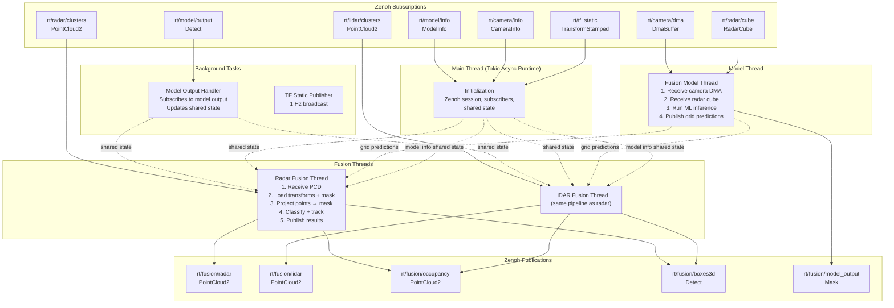
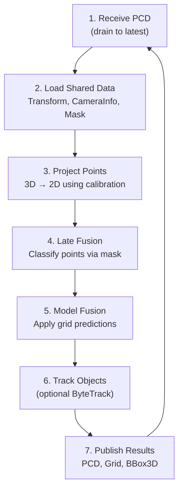

# EdgeFirst Fusion - Architecture

**Technical architecture documentation for developers**

This document describes the internal architecture of EdgeFirst Fusion, focusing on thread models, data flow patterns, and system design decisions. For user-facing documentation, see [README.md](README.md).

---

## Table of Contents

1. [System Overview](#system-overview)
2. [Thread Architecture](#thread-architecture)
3. [Data Flow](#data-flow)
4. [Message Formats](#message-formats)
5. [Hardware Integration](#hardware-integration)
6. [Instrumentation and Profiling](#instrumentation-and-profiling)
7. [References](#references)

---

## System Overview

EdgeFirst Fusion is a multi-threaded, asynchronous application built on the Tokio async runtime. It implements a **subscribe-process-publish** pattern where sensor data arrives via Zenoh subscriptions, is processed through fusion and tracking pipelines, and results are published back to Zenoh topics.

### Architecture Diagram



### Key Architectural Properties

- **Shared State via Mutex**: Camera info, model output, transforms, model predictions, and model info are shared between threads using `tokio::sync::Mutex`
- **Dedicated Fusion Threads**: Radar and LiDAR processing each run in their own thread with a dedicated single-threaded Tokio runtime
- **Independent Model Thread**: ML inference runs independently, publishing predictions consumed by fusion threads
- **Drain-on-Receive**: Fusion threads drain old messages and process only the latest, preventing queue buildup
- **Configurable Pipeline**: Sensor sources, output topics, and processing stages are all configurable via CLI

---

## Thread Architecture

### Main Thread (Tokio Multi-Threaded Runtime)

**Responsibilities:**

- Initialize Zenoh session and declare all subscribers/publishers
- Set up shared state (camera info, transforms, mask)
- Spawn dedicated processing threads
- Launch background tasks (TF static publisher, model output handler)

**Execution Model:**

The main thread runs within `#[tokio::main]` and coordinates startup:

1. Parse CLI arguments
2. Initialize tracing (stdout, journald, Tracy)
3. Open Zenoh session
4. Set up shared state with `Arc<Mutex<_>>`
5. Spawn model output handler thread
6. Spawn fusion model thread
7. Spawn radar and LiDAR fusion threads
8. Wait for fusion threads to complete

---

### Fusion Threads (Radar / LiDAR)

Each fusion thread runs a continuous processing loop:



**Processing Pipeline Details:**

1. **Receive**: Drain Zenoh subscription queue, process only the latest message. Includes exponential backoff timeout (2s → 1h) when no data arrives.
2. **Load**: Acquire locks on shared camera info, transforms, and segmentation mask. Skip frame if any required data is unavailable.
3. **Project**: Apply TF transform (sensor frame → base_link), then project 3D points to 2D camera coordinates using the camera intrinsic matrix.
4. **Late Fusion (Vision)**: For each projected point, sample the segmentation mask to assign a class label. Supports both clustered (per-cluster majority vote) and non-clustered (per-point) modes.
5. **Model Fusion**: Apply ML model grid predictions to classify points based on spatial proximity to predicted occupancy cells.
6. **Track**: ByteTrack tracker associates detections across frames using IoU matching and Kalman filtering. Maintains object persistence for configurable duration after disappearing.
7. **Publish**: Serialize enriched point cloud, occupancy grid, and 3D bounding boxes as ROS2 CDR messages and publish to Zenoh.

**Thread Count:** 1 per enabled sensor source (radar, LiDAR)

---

### Fusion Model Thread

**Responsibilities:**

- Subscribe to camera DMA buffers and radar cubes
- Pre-process inputs (image scaling via G2D, radar cube formatting)
- Run ML inference (TFLite or DeepView RT)
- Publish grid predictions to shared state

**Supported Engines:**

- **DeepView RT (.rtm)**: Au-Zone's inference runtime with NPU acceleration
- **TFLite (.tflite)**: TensorFlow Lite with optional delegate (NPU, GPU)

**Processing Pipeline:**

```
[Receive]     Camera DMA + Radar Cube
   ↓
[Preprocess]  G2D image resize + format conversion
   ↓          Radar cube normalization
[Inference]   TFLite or DeepView RT model execution
   ↓
[Postprocess] Sigmoid activation (optional)
   ↓          Grid extraction
[Publish]     Update shared grid state + publish mask
```

**Thread Count:** 1 (when `--model` is specified)

---

### Model Output Handler

**Responsibilities:**

Subscribes to unified vision model output topic. Deserializes detection boxes, instance segmentation masks, and semantic segmentation. Updates shared state for fusion threads.

**Thread Count:** 1

---

### TF Static Publisher (Background Task)

Publishes a static transform from `base_link` to `base_link_optical` at 1 Hz for ROS2 compatibility. Runs as a detached Tokio task on the main runtime's thread pool.

---

## Data Flow

### Shared State Communication

Threads communicate through shared state protected by `tokio::sync::Mutex`:

| State | Writer | Readers | Purpose |
|-------|--------|---------|---------|
| `CameraInfo` | Main thread (subscriber callback) | Fusion threads | Camera calibration matrix |
| `ModelOutput` | Model output handler | Fusion threads | Segmentation mask for late fusion |
| `Transform` | Main thread (subscriber callback) | Fusion threads | Sensor-to-base_link transforms |
| `Grid` | Model thread | Fusion threads | ML model occupancy predictions |
| `ModelInfo` | `model_info_callback` (Zenoh cb) | Fusion threads | Model info for dynamic label resolution |

### Drain-Receive Pattern

Fusion threads use a drain-receive pattern to ensure they always process the most recent data:

1. **Drain**: Call `sub.drain().last()` to discard queued messages and get the newest
2. **Timeout**: If no messages queued, block with exponential backoff timeout
3. **Backpressure**: Old messages are implicitly dropped, preventing processing lag

---

## Message Formats

All messages use **ROS2 CDR (Common Data Representation)** serialization.

### Input Messages

| Topic | Type | Description |
|-------|------|-------------|
| `rt/radar/clusters` | `sensor_msgs/PointCloud2` | Radar point cloud with optional cluster_id |
| `rt/lidar/clusters` | `sensor_msgs/PointCloud2` | LiDAR point cloud with optional cluster_id |
| `rt/camera/dma` | `edgefirst_msgs/DmaBuffer` | Camera frame as DMA buffer |
| `rt/radar/cube` | `edgefirst_msgs/RadarCube` | Radar cube for ML model input |
| `rt/model/output` | `edgefirst_msgs/Detect` | Unified vision model output (boxes, masks, segmentation) |
| `rt/model/info` | `edgefirst_msgs/ModelInfo` | Model info for dynamic label resolution |
| `rt/camera/info` | `sensor_msgs/CameraInfo` | Camera calibration parameters |
| `rt/tf_static` | `geometry_msgs/TransformStamped` | Static coordinate transforms |

### Output Messages

| Topic | Type | Description |
|-------|------|-------------|
| `rt/fusion/radar` | `sensor_msgs/PointCloud2` | Radar PCD with vision_class + instance_id fields |
| `rt/fusion/lidar` | `sensor_msgs/PointCloud2` | LiDAR PCD with vision_class + instance_id fields |
| `rt/fusion/occupancy` | `sensor_msgs/PointCloud2` | Occupancy grid as point cloud |
| `rt/fusion/boxes3d` | `edgefirst_msgs/Detect` | 3D bounding boxes from clustered points |
| `rt/fusion/model_output` | `edgefirst_msgs/Mask` | Raw ML model grid output |

### Enriched Point Cloud Fields

The fusion output adds classification fields to input point clouds:

| Field | Type | Description |
|-------|------|-------------|
| `x`, `y`, `z` | FLOAT32 | 3D coordinates (base_link frame) |
| `vision_class` | UINT16 | Class from vision model projection |
| `instance_id` | UINT16 | Instance identifier (0 = no instance) |
| `track_id` | UINT32 | Track hash (only present when tracking detected, 0 = untracked) |

> **Note:** When a fusion model is configured (early/mid fusion), the output uses a different layout with fusion_class(u8), vision_class(u8), and instance_id(u16).

---

## Hardware Integration

### NXP G2D - Image Format Conversion

Used by the fusion model thread to resize and convert camera frames for ML model input:

- **Format Conversion**: YUYV → RGB/NV12 for model input
- **Scaling**: Camera resolution → model input resolution
- **Rotation**: Configurable rotation support
- **Access**: Via `g2d-sys` crate FFI bindings to `/dev/galcore`

See `src/image.rs` for G2D integration.

### TFLite Runtime

Loaded dynamically via `tflitec-sys` FFI bindings:

- Searches for `libtensorflow-lite.so.2.X.Y` (versions 1-49, patches 0-9)
- Falls back to `libtensorflowlite_c.so`
- Supports external delegates (NPU acceleration) via `tflite_plugin_create_delegate`

See `tflitec-sys/` for FFI bindings and `src/tflite_model.rs` for model loading.

### DeepView RT Runtime

Au-Zone's inference runtime (`deepviewrt` crate), **feature-gated** behind `--features deepviewrt`:

- Native NPU acceleration on NXP i.MX8M Plus
- Loads `.rtm` model files
- DMA buffer input for zero-copy inference
- Requires `libdeepview-rt.so` installed on the target system

Build with DeepView RT support: `cargo build --release --features deepviewrt`

See `src/rtm_model.rs` for model loading.

### DMA Buffer Handling

Camera frames are received as DMA buffer file descriptors:

1. Extract file descriptor from Zenoh message using `pidfd_getfd`
2. Memory-map the DMA buffer with `mmap(MAP_SHARED)`
3. Pass to G2D for hardware-accelerated format conversion
4. Use converted buffer as ML model input

See `src/image.rs` for DMA buffer lifecycle management.

---

## Occupancy Grid Generation

Fusion generates occupancy grids from radar or LiDAR point clouds. Two modes are supported depending on whether the input PCD contains a `cluster_id` field:

**Clustered Mode** (PCD has `cluster_id`): Each cluster's centroid and bounding box are used to place occupied cells in the grid. Points are grouped by cluster ID, and the grid is populated directly from cluster geometry.

**Non-Clustered Mode** (PCD lacks `cluster_id`): Points are binned into a polar grid defined by `--range-bin-limit`, `--range-bin-width`, `--angle-bin-limit`, and `--angle-bin-width`. A temporal persistence filter (`--threshold`, `--bin-delay`) requires bins to be occupied for multiple frames before they are emitted, reducing noise.

The occupancy grid is published as a `sensor_msgs/PointCloud2` message on the `--grid-topic`.

---

## Instrumentation and Profiling

### Tracing Architecture

The application uses `tracing-subscriber` with multiple layers:

1. **stdout_log** - Console output with pretty formatting (filtered by `RUST_LOG`)
2. **journald** - systemd journal integration (filtered by `RUST_LOG`)
3. **tracy** - Tracy profiler integration (optional, `--tracy` flag)

### Tracy Integration

Key instrumented functions use `#[instrument]` attributes:

- `load_data` - Shared state acquisition timing
- `fusion` - Core fusion pipeline timing
- `publish` - Zenoh publishing timing
- `publish_bbox3d`, `publish_output`, `publish_grid` - Individual output timing

Frame marks track the fusion loop iteration rate.

### Instrumentation Points

**Fusion Thread:**
- PCD receive and deserialization
- Transform lookup and projection
- Late fusion classification
- Model prediction application
- Tracking update
- Result serialization and publishing

**Model Thread:**
- Camera DMA buffer reception
- Image preprocessing (G2D)
- Model inference timing
- Grid extraction and publishing

---

## References

**Rust Crates:**

- [tokio](https://tokio.rs/) - Async runtime
- [zenoh](https://zenoh.io/) - Pub/sub middleware
- [nalgebra](https://nalgebra.org/) - Linear algebra for transforms
- [ndarray](https://docs.rs/ndarray/) - N-dimensional arrays for model I/O
- [deepviewrt](https://crates.io/crates/deepviewrt) - DeepView RT inference runtime

**Hardware Documentation:**

- [NXP i.MX8M Plus Reference Manual](https://www.nxp.com/docs/en/reference-manual/IMX8MPRM.pdf)

**ROS2 Standards:**

- [ROS2 CDR Serialization](https://design.ros2.org/articles/generated_interfaces_cpp.html)
- [sensor_msgs/PointCloud2](https://docs.ros2.org/latest/api/sensor_msgs/msg/PointCloud2.html)
- [sensor_msgs/CameraInfo](https://docs.ros2.org/latest/api/sensor_msgs/msg/CameraInfo.html)

**Algorithms:**

- [ByteTrack: Multi-Object Tracking by Associating Every Detection Box](https://arxiv.org/abs/2110.06864)
- [Kalman Filter](https://en.wikipedia.org/wiki/Kalman_filter) - State estimation for object tracking
