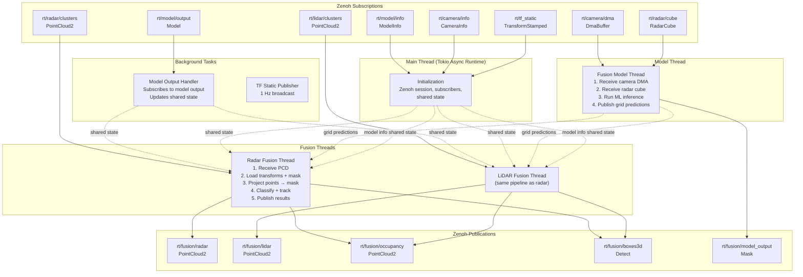
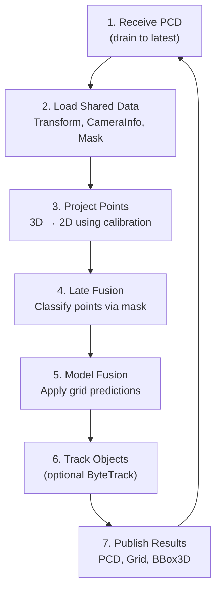
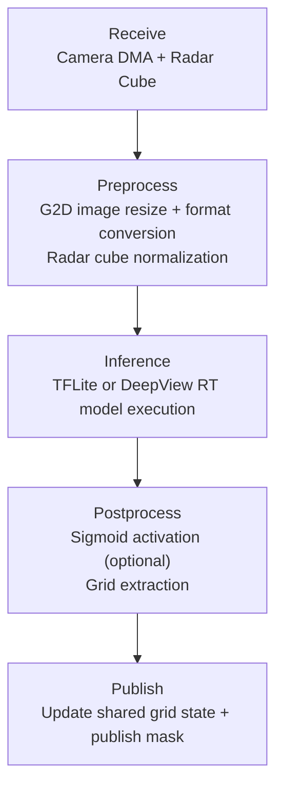
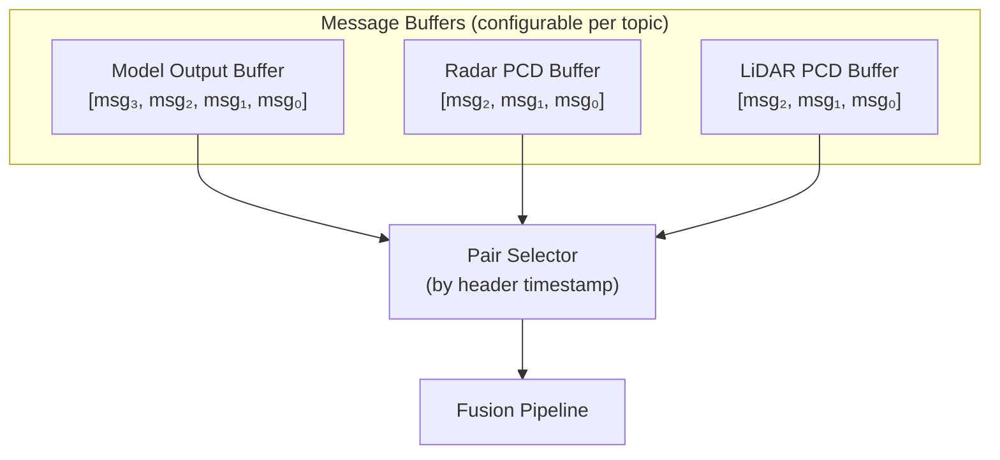
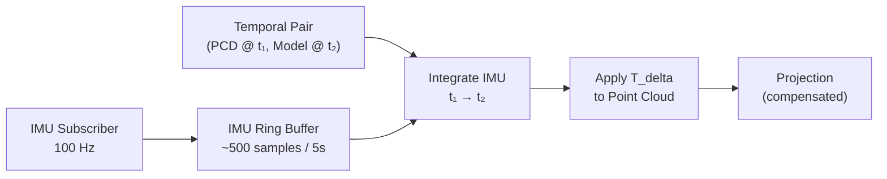

# EdgeFirst Fusion - Architecture

**Technical architecture documentation for developers**

This document describes the internal architecture of EdgeFirst Fusion, focusing on thread models, data flow patterns, and system design decisions. For user-facing documentation, see [README.md](README.md).

---

## Table of Contents

1. [System Overview](#system-overview)
2. [Thread Architecture](#thread-architecture)
3. [Data Flow](#data-flow)
4. [Fusion Algorithms](#fusion-algorithms)
5. [Projection Improvements](#projection-improvements)
6. [Calibration Requirements](#calibration-requirements)
7. [Temporal Synchronization](#temporal-synchronization)
8. [Temporal Alignment](#temporal-alignment)
9. [IMU-Based Motion Compensation](#imu-based-motion-compensation)
10. [Message Formats](#message-formats)
11. [Hardware Integration](#hardware-integration)
12. [Occupancy Grid Generation](#occupancy-grid-generation)
13. [Instrumentation and Profiling](#instrumentation-and-profiling)
14. [Limitations and Future Research](#limitations-and-future-research)
15. [References](#references)

---

## System Overview

EdgeFirst Fusion is a multi-threaded, asynchronous application built on the Tokio async runtime. It implements a **subscribe-process-publish** pattern where sensor data arrives via Zenoh subscriptions, is processed through fusion and tracking pipelines, and results are published back to Zenoh topics.

### Architecture Diagram


```mermaid
graph TB
    subgraph "Zenoh Subscriptions"
        RadarSub["rt/radar/clusters<br/>PointCloud2"]
        LidarSub["rt/lidar/clusters<br/>PointCloud2"]
        CameraSub["rt/camera/dma<br/>DmaBuffer"]
        ModelSub["rt/model/output<br/>Model"]
        InfoSub["rt/camera/info<br/>CameraInfo"]
        TFSub["rt/tf_static<br/>TransformStamped"]
        CubeSub["rt/radar/cube<br/>RadarCube"]
        ModelInfoSub["rt/model/info<br/>ModelInfo"]
    end

    subgraph "Main Thread (Tokio Async Runtime)"
        Init["Initialization<br/>Zenoh session, subscribers,<br/>shared state"]
    end

    subgraph "Fusion Threads"
        RadarThread["Radar Fusion Thread<br/>1. Receive PCD<br/>2. Load transforms + mask<br/>3. Project points → mask<br/>4. Classify + track<br/>5. Publish results"]
        LidarThread["LiDAR Fusion Thread<br/>(same pipeline as radar)"]
    end

    subgraph "Model Thread"
        ModelThread["Fusion Model Thread<br/>1. Receive camera DMA<br/>2. Receive radar cube<br/>3. Run ML inference<br/>4. Publish grid predictions"]
    end

    subgraph "Background Tasks"
        ModelTask["Model Output Handler<br/>Subscribes to model output<br/>Updates shared state"]
        TFTask["TF Static Publisher<br/>1 Hz broadcast"]
    end

    subgraph "Zenoh Publications"
        RadarOut["rt/fusion/radar<br/>PointCloud2"]
        LidarOut["rt/fusion/lidar<br/>PointCloud2"]
        GridOut["rt/fusion/occupancy<br/>PointCloud2"]
        BBoxOut["rt/fusion/boxes3d<br/>Detect"]
        ModelOut["rt/fusion/model_output<br/>Mask"]
    end

    RadarSub --> RadarThread
    LidarSub --> LidarThread
    CameraSub --> ModelThread
    CubeSub --> ModelThread
    ModelSub --> ModelTask
    ModelInfoSub --> Init
    InfoSub --> Init
    TFSub --> Init

    RadarThread --> RadarOut
    RadarThread --> GridOut
    RadarThread --> BBoxOut
    LidarThread --> LidarOut
    LidarThread --> GridOut
    LidarThread --> BBoxOut
    ModelThread --> ModelOut

    ModelTask -.->|"shared state"| RadarThread
    ModelTask -.->|"shared state"| LidarThread
    Init -.->|"shared state"| RadarThread
    Init -.->|"shared state"| LidarThread
    ModelThread -.->|"grid predictions"| RadarThread
    ModelThread -.->|"grid predictions"| LidarThread
    Init -.->|"model info shared state"| RadarThread
    Init -.->|"model info shared state"| LidarThread
```

### Key Architectural Properties

- **Shared State via Mutex**: Camera info, model output, transforms, model predictions, and model info are shared between threads using `tokio::sync::Mutex`
- **Dedicated Fusion Threads**: Radar and LiDAR processing each run in their own thread with a dedicated single-threaded Tokio runtime
- **Independent Model Thread**: ML inference runs independently, publishing predictions consumed by fusion threads
- **Drain-on-Receive**: Fusion threads drain old messages and process only the latest, preventing queue buildup
- **Configurable Pipeline**: Sensor sources, output topics, and processing stages are all configurable via CLI

---

## Thread Architecture

### Main Thread (Tokio Multi-Threaded Runtime)

**Responsibilities:**

- Initialize Zenoh session and declare all subscribers/publishers
- Set up shared state (camera info, transforms, mask)
- Spawn dedicated processing threads
- Launch background tasks (TF static publisher, model output handler)

**Execution Model:**

The main thread runs within `#[tokio::main]` and coordinates startup:

1. Parse CLI arguments
2. Initialize tracing (stdout, journald, Tracy)
3. Open Zenoh session
4. Set up shared state with `Arc<Mutex<_>>`
5. Spawn model output handler thread
6. Spawn fusion model thread
7. Spawn radar and LiDAR fusion threads
8. Wait for fusion threads to complete

---

### Fusion Threads (Radar / LiDAR)

Each fusion thread runs a continuous processing loop:


```mermaid
graph TD
    Receive["1. Receive PCD<br/>(drain to latest)"] --> Load["2. Load Shared Data<br/>Transform, CameraInfo, Mask"]
    Load --> Project["3. Project Points<br/>3D → 2D using calibration"]
    Project --> Classify["4. Late Fusion<br/>Classify points via mask"]
    Classify --> ModelFuse["5. Model Fusion<br/>Apply grid predictions"]
    ModelFuse --> Track["6. Track Objects<br/>(optional ByteTrack)"]
    Track --> Publish["7. Publish Results<br/>PCD, Grid, BBox3D"]
    Publish --> Receive
```

**Processing Pipeline Details:**

1. **Receive**: Drain Zenoh subscription queue, process only the latest message. Includes exponential backoff timeout (2s → 1h) when no data arrives.
2. **Load**: Acquire locks on shared camera info, transforms, and segmentation mask. Skip frame if any required data is unavailable.
3. **Project**: Using the TF transform (base_link → sensor) and camera intrinsics, project 3D points to 2D camera coordinates. The original point XYZ values are **not modified** — the projection is used only to determine which pixel each point maps to for classification. The output retains the original sensor-frame coordinates and `frame_id`.
4. **Late Fusion (Vision)**: For each projected point, sample the segmentation mask to assign a class label. Supports both clustered (per-cluster majority vote) and non-clustered (per-point) modes.
5. **Model Fusion**: Apply ML model grid predictions to classify points based on spatial proximity to predicted occupancy cells.
6. **Track**: ByteTrack tracker associates detections across frames using IoU matching and Kalman filtering. Maintains object persistence for configurable duration after disappearing.
7. **Publish**: Serialize enriched point cloud, occupancy grid, and 3D bounding boxes as ROS2 CDR messages and publish to Zenoh.

**Thread Count:** 1 per enabled sensor source (radar, LiDAR)

---

### Fusion Model Thread

**Responsibilities:**

- Subscribe to camera DMA buffers and radar cubes
- Pre-process inputs (image scaling via G2D, radar cube formatting)
- Run ML inference (TFLite or DeepView RT)
- Publish grid predictions to shared state

**Supported Engines:**

- **DeepView RT (.rtm)**: Au-Zone's inference runtime with NPU acceleration
- **TFLite (.tflite)**: TensorFlow Lite with optional delegate (NPU, GPU)

**Processing Pipeline:**


```mermaid
graph TD
    Receive["Receive<br/>Camera DMA + Radar Cube"] --> Preprocess["Preprocess<br/>G2D image resize + format conversion<br/>Radar cube normalization"]
    Preprocess --> Inference["Inference<br/>TFLite or DeepView RT model execution"]
    Inference --> Postprocess["Postprocess<br/>Sigmoid activation (optional)<br/>Grid extraction"]
    Postprocess --> Publish["Publish<br/>Update shared grid state + publish mask"]
```

**Thread Count:** 1 (when `--model` is specified)

---

### Model Output Handler

**Responsibilities:**

Subscribes to unified vision model output topic. Deserializes detection boxes, instance segmentation masks, and semantic segmentation. Updates shared state for fusion threads.

**Thread Count:** 1

---

### TF Static Publisher (Background Task)

Publishes a static transform from `base_link` to `base_link_optical` at 1 Hz for ROS2 compatibility. Runs as a detached Tokio task on the main runtime's thread pool.

---

## Data Flow

### Shared State Communication

Threads communicate through shared state protected by `tokio::sync::Mutex`:

| State | Writer | Readers | Purpose |
|-------|--------|---------|---------|
| `CameraInfo` | Main thread (subscriber callback) | Fusion threads | Camera calibration matrix |
| `ModelOutput` | Model output handler | Fusion threads | Segmentation mask for late fusion |
| `Transform` | Main thread (subscriber callback) | Fusion threads | Sensor-to-base_link transforms |
| `Grid` | Model thread | Fusion threads | ML model occupancy predictions |
| `ModelInfo` | `model_info_callback` (Zenoh cb) | Fusion threads | Model info for dynamic label resolution |

### Drain-Receive Pattern

Fusion threads use a drain-receive pattern to ensure they always process the most recent data:

1. **Drain**: Call `sub.drain().last()` to discard queued messages and get the newest
2. **Timeout**: If no messages queued, block with exponential backoff timeout
3. **Backpressure**: Old messages are implicitly dropped, preventing processing lag

---

## Fusion Algorithms

EdgeFirst Fusion implements **projection-based sensor fusion**, where 3D points from radar or LiDAR are projected into the camera's 2D image plane to inherit semantic information from a vision model. The system supports two primary fusion pathways: **late fusion** (projection onto vision model output) and **model fusion** (early/mid fusion via a dedicated ML model).

### 3D-to-2D Projection

The core of projection-based fusion is transforming each 3D sensor point into 2D camera pixel coordinates. This uses the standard pinhole camera model composed with extrinsic transforms:

1. **Compose the sensor-to-camera transform:**

   ```
   T_cam_sensor = T_base_cam⁻¹ · T_base_sensor
   ```

   Where `T_base_cam` is the camera-to-base_link transform and `T_base_sensor` is the sensor (radar or LiDAR) to-base_link transform. Both are obtained from `tf_static` messages.

2. **Transform each 3D point into the camera frame:**

   ```
   [cam_x, cam_y, cam_z, 1]ᵀ = T_cam_sensor · [x, y, z, 1]ᵀ
   ```

3. **Project using the pinhole camera model:**

   ```
   u = (fx · cam_x / cam_z + cx) / width
   v = (fy · cam_y / cam_z + cy) / height
   ```

   Where `fx`, `fy`, `cx`, `cy` are the camera intrinsics from the `CameraInfo.k` matrix. The output `(u, v)` is normalized to `[0, 1]` image coordinates.

4. **Reject behind-camera points:** Points with `cam_z ≤ 0` are assigned out-of-bounds coordinates `(2.0, 2.0)` and will not receive a class label.

**Important:** The projection is used *only* to determine which pixel each 3D point maps to for classification. The original point `(x, y, z)` coordinates are **never modified** — the output retains the original sensor-frame coordinates and `frame_id`.

On `aarch64` targets, the projection inner loop is **NEON SIMD-optimized**, processing 4 points per iteration for improved throughput on embedded ARM platforms.

See `src/transform.rs` for the projection implementation.

### Late Fusion (Vision Model Projection)

Late fusion classifies 3D points by projecting them onto the output of an independently-running vision model. Two vision model output types are supported:

#### Semantic Segmentation Mask

When the vision model produces a semantic segmentation mask, each projected `(u, v)` coordinate samples the mask directly to obtain a class index. Two modes are available:

- **Non-clustered mode:** Each point is independently classified by sampling the mask at its projected position.
- **Clustered mode:** Points grouped by `cluster_id` are processed together. Connected components are detected in the mask via flood-fill to identify instance regions. Each 3D cluster is matched to a 2D instance based on projection overlap, and a majority-vote determines the cluster's class label.

#### Detection Boxes

When the vision model produces 2D detection bounding boxes (without a segmentation mask), projected points are tested for containment within detection boxes:

- **Non-clustered mode:** Each point is classified by the detection box it falls within.
- **Clustered mode:** Clusters are matched to detection boxes based on projected point overlap.

The `background_index` parameter controls which class index represents "no detection," preventing false classification of points that project into unclassified image regions.

### Model Fusion (Early/Mid Fusion)

When a fusion model is configured (`--model`), the system runs a dedicated ML model that takes camera frames and radar cubes as joint input. The model produces grid-based occupancy and class predictions, which are mapped back to 3D sensor points:

1. Camera DMA buffer and radar cube are received and preprocessed
2. The ML model (TFLite or DeepView RT) produces a grid of class probabilities
3. Each 3D point is mapped to its nearest grid cell via 2D projection
4. The grid cell's predicted class is assigned to the point

This pathway enables learned multi-modal fusion rather than purely geometric projection.

---

## Projection Improvements

> **Context:** EdgeFirst Fusion primarily targets off-highway vehicles (OHV) and robotics applications — construction, mining, agriculture, and similar environments where typical operating speeds are below 40 km/h. The improvements below are prioritized for this operating envelope.

The current projection pipeline uses a standard pinhole model with hard nearest-neighbor mask lookup. Several enhancements can improve classification accuracy, prioritized by impact in OHV/robotics scenarios.

### Radar Angular Uncertainty

Automotive radar (77 GHz) has typical angular resolution of 1–5° in azimuth and 5–15° in elevation. A single radar detection maps to a region spanning tens of pixels in the camera image, not a single point. Projecting radar points as if they were geometrically precise (like LiDAR) causes misassociation.

**Improvement:** Expand the association region when projecting radar points. Rather than checking if the projected `(u, v)` falls within a detection box or mask region, test whether a margin around the projection overlaps. The margin should be proportional to the radar's angular resolution and the detection's range:

```
margin_u = fx · tan(σ_azimuth)
margin_v = fy · tan(σ_elevation)
```

For a 2° azimuth uncertainty at `fx = 1260`: `margin_u ≈ 44 pixels`. For radars that provide only 2D detections (range and azimuth, no elevation), match on the horizontal axis only and accept any vertical position.

This is the highest-priority projection improvement for radar-camera fusion. See CenterFusion (Nabati & Qi, 2021) for the expanded-region approach.

### Occlusion Handling

When multiple 3D points project to similar 2D locations, points behind foreground objects can incorrectly inherit the foreground's class label. For example, a tree's LiDAR points could be classified as "vehicle" if a vehicle is between the tree and the camera.

**Improvement:** Maintain a lightweight depth buffer at reduced resolution (e.g., 1/4 of the image). During projection, record the nearest `cam_z` for each cell. Points whose `cam_z` exceeds the cell's recorded depth by more than a threshold are flagged as potentially occluded and should not receive a camera-derived label. This is O(N) and cache-friendly.

### Sub-Pixel Interpolation

The current projection normalizes to `[0, 1]` and the mask lookup uses nearest-neighbor sampling. When a point projects to fractional coordinates near a class boundary, this can cause misclassification.

**Improvement:** When the vision model provides probability maps (softmax outputs) rather than hard class labels, use bilinear interpolation at the projected `(u, v)` coordinates. Sample the four surrounding pixels weighted by fractional distance to obtain interpolated class probabilities. This is most beneficial at mask boundaries and for distant objects where projection precision matters.

### Distance-Dependent Confidence

Points at greater distance have larger positional uncertainty in the projected image plane — a 0.1° angular error at 50 m produces 8.7 cm offset versus 1.7 cm at 10 m. Additionally, the vision model's segmentation mask has fixed pixel resolution, so distant objects occupy fewer pixels and are more prone to misclassification.

**Improvement:** Apply a configurable confidence decay beyond a distance threshold. Points beyond the threshold receive reduced trust in their camera-derived label. In OHV applications, the relevant operating range is typically 0–50 m, with a suggested decay onset at 30–40 m.

### Rolling Shutter Compensation

> **Priority:** Lower for OHV (significant only above ~40 km/h)

Rolling shutter cameras expose rows sequentially across the frame period (~33 ms at 30 fps). At vehicle speed, this causes per-row displacement — objects at different image rows were captured at slightly different times. At 40 km/h, maximum displacement across a full frame is ~37 cm, producing several pixels of projection error for objects at close range.

**Improvement:** If the camera readout direction and line timing are known, apply a per-row ego-motion correction to the extrinsic transform using IMU data: `T_corrected(row) = T_cam_lidar · T_ego_motion(t_row - t_ref)`. This is inexpensive on the i.MX8MP (linear interpolation between two transforms) but requires the [IMU-Based Motion Compensation](#imu-based-motion-compensation) pipeline to be in place.

For OHV applications below 40 km/h, rolling shutter error is generally within tolerance and this enhancement is lower priority than temporal alignment and radar uncertainty improvements.

---

## Calibration Requirements

Proper calibration is essential for accurate fusion. The system requires both **intrinsic** (camera-internal) and **extrinsic** (sensor-to-sensor spatial relationship) calibration.

### Camera Intrinsic Calibration

The camera must be **fully calibrated** with a rectified image. Camera intrinsics are provided via `sensor_msgs/CameraInfo` messages on the camera info topic, which include the 3×3 camera matrix `K`:

```
K = [fx,  0, cx]
    [ 0, fy, cy]
    [ 0,  0,  1]
```

Along with the image `width` and `height`.

**Pre-rectification requirement:** The fusion service expects the camera image to be **pre-rectified by the ISP** (Image Signal Processor). Lens distortion correction (dewarp) must be handled upstream by the camera pipeline before frames reach the fusion service. The fusion service does not perform any distortion correction internally.

### Extrinsic Calibration (Coordinate Transforms)

Extrinsic calibration describes the spatial relationship between sensors. All transforms are expressed relative to `base_link` and communicated via `tf_static` messages (typically published at 1 Hz).

**Current design:** Fusion composes transforms through `base_link` to keep the transform chain simple. Currently, the system is tested with the **camera as `base_link`** (identity transform for camera-to-base_link).

#### Required Transforms

| From | To | Source | Notes |
|------|----|--------|-------|
| Camera | `base_link` | `tf_static` | Identity if camera *is* `base_link` |
| Radar | `base_link` | `tf_static` | Radar extrinsic calibration |
| LiDAR | `base_link` | `tf_static` | LiDAR extrinsic calibration |

Each sensor publisher is responsible for broadcasting its own transform from `base_link` on the `tf_static` topic. If a required transform is missing at fusion time, the fusion thread logs a warning and defaults to the identity transform (which will produce incorrect projections).

#### Transform Composition

The fusion service composes the sensor-to-camera transform at runtime:

```
T_cam_sensor = T_base_cam⁻¹ · T_base_sensor
```

This avoids requiring direct sensor-to-camera calibration — each sensor only needs to know its relationship to `base_link`.

---

## Temporal Synchronization

Accurate fusion depends on all sensor timestamps representing the **actual real-world observation time** as closely as possible. This section describes the timestamp conventions and clock synchronization requirements that sensor publishers must follow.

### Timestamp Convention

All sensor publishers must timestamp their messages with the **earliest measurable time of the observation event**, not the time at which the data was read or processed:

- **Camera:** The EdgeFirst camera publisher ([edgefirst-camera](https://github.com/EdgeFirstAI/camera)) uses the timestamp from the V4L2 capture buffer, which reflects when the MIPI capture driver recorded the frame — not when the application read the buffer. This timestamp originates from the capture hardware and represents the start of frame exposure.

- **LiDAR:** LiDAR publishers emit a start-of-frame timestamp based on the LiDAR device's internal clock. The [edgefirst-lidarpub](https://github.com/EdgeFirstAI/lidarpub) service uses this device timestamp when available and synchronized; if the device clock is missing or unsynchronized, it falls back to the host timestamp of the first received packet for that frame. Refer to the [edgefirst-lidarpub](https://github.com/EdgeFirstAI/lidarpub) service and specific LiDAR device documentation for details.

- **Radar:** Radar publishers follow the same convention as LiDAR. The [edgefirst-radarpub](https://github.com/EdgeFirstAI/radarpub) service uses the radar device's start-of-frame timestamp when available and synchronized, falling back to the host timestamp of the first packet otherwise. Refer to the [edgefirst-radarpub](https://github.com/EdgeFirstAI/radarpub) service and specific radar device documentation for details.

- **Model output:** The [edgefirst-model](https://github.com/EdgeFirstAI/model) service publishes its output using the **timestamp of the camera frame that produced the result**. While a model running at 100 ms latency produces output ~100 ms after the camera frame was published, the output message carries the original camera frame's timestamp. This is critical for proper temporal alignment — the model output timestamp indicates *when the observation occurred*, not when inference completed. The model service also publishes detailed model timing information for latency monitoring, but these timings are informational and not used for synchronization.

### Clock Synchronization

All sensor clocks must be synchronized to a common time base to ensure timestamps are comparable across devices:

- **Host system clock:** The primary time reference. Camera timestamps from V4L2 are derived from the host kernel clock.
- **LiDAR and radar device clocks:** Must be synchronized to the host system using **PTP (Precision Time Protocol)** to ensure sub-millisecond clock alignment. Unsynchronized device clocks will cause the respective publisher to fall back to host-side packet timestamps, which have lower precision.
- **Triggered capture (recommended):** For highest temporal precision, system integrators should use cameras with **hardware trigger and strobe signals**, enabling GPIO-controlled capture with high-resolution timestamps. This ensures deterministic capture timing across all sensors rather than relying on free-running frame rates.

### Current Implementation

The current fusion service uses a **drain-to-latest** strategy: when a new point cloud arrives, it drains the subscription queue and processes only the most recent message, pairing it with whatever model output is currently held in shared state.

This approach is simple but does not guarantee temporal alignment between the point cloud and the vision model output used for fusion. The [Temporal Alignment](#temporal-alignment) section describes the target architecture for proper timestamp-based pair selection.

---

## Temporal Alignment

> **Status:** This section describes the target architecture for timestamp-based temporal alignment. It serves as the design specification for implementation.

The fusion service must select **temporally aligned pairs** of sensor inputs for fusion, matching by their message header timestamps (real-world observation time), not by receive time. This ensures that the 3D point cloud and the vision model output used for classification correspond to the same moment in time.

### Buffered Input Architecture

Rather than draining to the latest message and discarding history, the fusion service should maintain **per-topic message buffers** using async readers:


```mermaid
graph TD
    subgraph Buffers["Message Buffers (configurable per topic)"]
        ModelBuf["Model Output Buffer<br/>[msg₃, msg₂, msg₁, msg₀]"]
        RadarBuf["Radar PCD Buffer<br/>[msg₂, msg₁, msg₀]"]
        LidarBuf["LiDAR PCD Buffer<br/>[msg₂, msg₁, msg₀]"]
    end

    ModelBuf --> Selector["Pair Selector<br/>(by header timestamp)"]
    RadarBuf --> Selector
    LidarBuf --> Selector
    Selector --> Pipeline["Fusion Pipeline"]
```

Each input topic is read asynchronously (async tasks preferred over dedicated threads) and messages are appended to a bounded ring buffer. Old messages beyond the buffer length are discarded.

### Buffer Size Configuration

Buffer lengths should be configurable per topic with reasonable defaults based on typical sensor rates:

| Topic | Typical Rate | Suggested Default Buffer |
|-------|-------------|------------------------|
| Model output | 10–30 Hz | 5 messages |
| Radar PCD | 10–20 Hz | 5 messages |
| LiDAR PCD | 10–20 Hz | 5 messages |

Buffers should be sized to hold at least enough messages to span the maximum expected temporal offset between sensors, without consuming excessive memory.

### Pair Selection Algorithm

The fusion service should output at the rate of its **slowest input topic** (model output or point cloud, whichever is slower). The camera itself is not directly consumed by projection-based fusion — it flows through the model service.

#### Naive Approach — Fixed-Rate Timer

A timer fires at the desired output rate (e.g., 10 Hz). On each tick:

1. Scan the point cloud buffer from most recent to oldest
2. For each candidate point cloud, find the model output with the closest matching timestamp
3. Select the pair with the smallest temporal delta
4. Fuse and publish

This approach is simple but may introduce up to one timer period of additional latency.

#### Adaptive Approach — Rate-Aware Scheduling

A higher-frequency timer (e.g., 100 Hz) evaluates whether to fuse now or wait:

1. Track per-topic publishing statistics: min, max, and average inter-message intervals, plus the timestamp of the last received message
2. On each tick, find the best available pair (smallest temporal delta)
3. Estimate whether a better pair is imminent based on publishing rate statistics (e.g., if a new model output is expected within 5 ms, wait)
4. If no better pair is expected soon, or the best pair's age exceeds a configurable threshold, fuse and publish immediately

This reduces latency by fusing as soon as a good pair is available rather than waiting for a fixed timer.

### Temporal Matching Criteria

Pair selection must use the **message header timestamp** (`header.stamp`), which represents the real-world observation time as described in [Temporal Synchronization](#temporal-synchronization). Receive time must **never** be used for pair matching.

The fusion service should track and expose the temporal delta of each fused pair for monitoring and diagnostics. A configurable **maximum temporal delta** threshold should warn or skip fusion when the best available pair exceeds acceptable alignment (e.g., > 100 ms apart).

### Latency Tracking

The fusion service should maintain per-topic statistics for monitoring:

- **Inter-message interval:** min, max, rolling average of time between consecutive messages (by header timestamp)
- **Last received timestamp:** header timestamp of the most recent message per topic
- **Pair temporal delta:** the timestamp difference between paired inputs for each fusion cycle
- **End-to-end latency:** wall-clock time from earliest input timestamp in a fused pair to publication of the fusion result

These statistics enable system integrators to diagnose synchronization issues and tune buffer sizes and output rates.

---

## IMU-Based Motion Compensation

> **Status:** This section describes a future enhancement. It depends on [Temporal Alignment](#temporal-alignment) being implemented first.

Even with proper temporal pair selection, the point cloud and camera frame will rarely share exactly the same timestamp. The residual temporal offset means the sensor platform moved between the two capture times, introducing projection error. IMU-based motion compensation corrects this by transforming the point cloud to the camera frame's observation time.

### Operating Envelope

At typical OHV speeds (under 40 km/h / 11.1 m/s), the displacement over common temporal offsets is:

| Temporal Offset | Displacement at 20 km/h | Displacement at 40 km/h |
|----------------|------------------------|------------------------|
| 10 ms | 5.6 cm | 11.1 cm |
| 25 ms | 13.9 cm | 27.8 cm |
| 50 ms | 27.8 cm | 55.6 cm |

At 10–20 m range with a typical camera, 10 cm of displacement corresponds to roughly 5–10 pixels of projection error. For close-range objects (under 10 m), this error doubles. Motion compensation eliminates this source of misclassification for static objects.

### Compensation Architecture

The fusion service subscribes to an IMU topic (e.g., `rt/imu/data`) and maintains a ring buffer of timestamped IMU samples. When a point cloud and model output are paired for fusion, the IMU buffer is queried to compute the ego-motion between their timestamps.


```mermaid
graph LR
    IMU["IMU Subscriber<br/>100 Hz"] --> Buffer["IMU Ring Buffer<br/>~500 samples / 5s"]
    Pair["Temporal Pair<br/>(PCD @ t₁, Model @ t₂)"] --> Integrate["Integrate IMU<br/>t₁ → t₂"]
    Buffer --> Integrate
    Integrate --> Transform["Apply T_delta<br/>to Point Cloud"]
    Transform --> Project["Projection<br/>(compensated)"]
```

**Pipeline order:** Temporal pair selection occurs first (selecting the best-matching timestamps), then IMU compensation is applied to the point cloud *before* extrinsic transform and projection. This ensures the 3D points are spatially aligned to the camera's observation time before being projected into the image.

### Rotation vs Translation Compensation

IMU-based compensation has two components with different requirements:

**Rotation (gyroscope integration):** Self-contained and highly accurate over short intervals. The gyroscope directly measures angular velocity, and integration over 10–50 ms produces sub-millidegree error with automotive-grade MEMS IMUs. No external information is required.

**Translation (accelerometer double-integration):** Requires an initial velocity estimate because the accelerometer measures acceleration, not velocity. The IMU alone cannot determine translation without knowing `v₀`. An external velocity source is needed — typically vehicle odometry from CAN bus wheel speed sensors or a state estimator.

**Recommendation:** Implement rotation-only compensation first (gyroscope integration), as it requires no external velocity source and corrects the dominant error component for rotating/turning vehicles. Add translation compensation when vehicle odometry is available.

### IMU Integration Algorithm

Given IMU samples between timestamps `t_start` (point cloud) and `t_end` (camera frame):

1. **Bracket the interval:** Binary search the IMU buffer to find samples spanning `[t_start, t_end]`. Interpolate (LERP) endpoint samples if exact timestamps are not available.

2. **Integrate rotation:** For each consecutive pair of IMU samples in the interval, update the rotation using midpoint integration:

   ```
   w_mid = 0.5 · (w_k + w_{k+1})
   dt = t_{k+1} - t_k
   R = R · Exp(w_mid · dt)
   ```

   Where `Exp()` is the SO(3) exponential map (Rodrigues' formula). Initialize `R = I` (identity).

3. **Integrate translation (when velocity available):**

   ```
   v = v₀ + R · (a_k - g) · dt
   p = p + v · dt + 0.5 · R · (a_k - g) · dt²
   ```

   Where `g` is gravity (must be subtracted from accelerometer readings) and `v₀` is the initial velocity from odometry. For rotation-only mode, skip this step.

4. **Apply to point cloud:** Transform each point: `p_corrected = R · p_i + t` (or `R · p_i` for rotation-only).

### IMU Buffering

| Parameter | Value | Notes |
|-----------|-------|-------|
| IMU rate | 30–100 Hz | Higher is better; 100 Hz recommended |
| Buffer depth | 500 samples | ~5 seconds at 100 Hz |
| Memory | ~14 KB | Negligible on i.MX8MP |
| Lookup | Binary search | `VecDeque` with `partition_point` |
| Interpolation | Linear (LERP) | For gyro and accel at bracketing samples |

### Computational Cost

On the i.MX8MP (4× Cortex-A53 @ 1.8 GHz with NEON SIMD):

- **IMU integration** (1–5 samples over 10–50 ms): ~30–150 FLOPs — negligible
- **Point cloud transformation** (50K points): ~1.8 MFLOP — under 0.5 ms with NEON
- **Total overhead:** Well under 1 ms per fusion cycle, real-time feasible with large margin

### Per-Point Deskewing (Future Enhancement)

Spinning LiDARs capture points over the full rotation period (~100 ms). During that time, the platform moves, causing within-scan distortion. Per-point deskewing corrects each point individually using its per-point timestamp and the IMU trajectory, rather than applying a single whole-frame transform.

This is a well-established technique in LiDAR SLAM systems (LOAM, LIO-SAM, FAST-LIO) and provides meaningful improvement at higher speeds or with fast-rotating vehicles. For OHV applications at lower speeds, whole-frame compensation addresses the primary source of error (inter-sensor temporal offset), and per-point deskewing is a lower-priority enhancement.

### Extrinsic Requirements

IMU-based compensation requires knowing the IMU-to-sensor extrinsic calibration. If the IMU is rigidly mounted relative to the LiDAR/radar, the compensation transform must account for the lever arm:

```
T_sensor_at_t_cam = T_imu_sensor⁻¹ · T_delta_imu · T_imu_sensor · T_sensor_at_t_pcd
```

If the IMU is co-located with `base_link`, the existing transform chain through `base_link` handles this naturally.

---

## Message Formats

All messages use **ROS2 CDR (Common Data Representation)** serialization.

### Input Messages

| Topic | Type | Description |
|-------|------|-------------|
| `rt/radar/clusters` | `sensor_msgs/PointCloud2` | Radar point cloud with optional cluster_id |
| `rt/lidar/clusters` | `sensor_msgs/PointCloud2` | LiDAR point cloud with optional cluster_id |
| `rt/camera/dma` | `edgefirst_msgs/DmaBuffer` | Camera frame as DMA buffer |
| `rt/radar/cube` | `edgefirst_msgs/RadarCube` | Radar cube for ML model input |
| `rt/model/output` | `edgefirst_msgs/Model` | Unified vision model output (boxes, masks, segmentation) |
| `rt/model/info` | `edgefirst_msgs/ModelInfo` | Model info for dynamic label resolution |
| `rt/camera/info` | `sensor_msgs/CameraInfo` | Camera calibration parameters |
| `rt/tf_static` | `geometry_msgs/TransformStamped` | Static coordinate transforms |

### Output Messages

| Topic | Type | Description |
|-------|------|-------------|
| `rt/fusion/radar` | `sensor_msgs/PointCloud2` | Radar PCD with vision_class + instance_id fields |
| `rt/fusion/lidar` | `sensor_msgs/PointCloud2` | LiDAR PCD with vision_class + instance_id fields |
| `rt/fusion/occupancy` | `sensor_msgs/PointCloud2` | Occupancy grid as point cloud |
| `rt/fusion/boxes3d` | `edgefirst_msgs/Detect` | 3D bounding boxes from clustered points |
| `rt/fusion/model_output` | `edgefirst_msgs/Mask` | Raw ML model grid output |

### Enriched Point Cloud Fields

The fusion output adds classification fields to input point clouds:

| Field | Type | Description |
|-------|------|-------------|
| `x`, `y`, `z` | FLOAT32 | 3D coordinates (unchanged from source, in the original sensor frame) |
| `vision_class` | UINT16 | Class from vision model projection |
| `instance_id` | UINT16 | Instance identifier (0 = no instance) |
| `track_id` | UINT32 | Track hash (only present when tracking detected, 0 = untracked) |

> **Note:** When a fusion model is configured (early/mid fusion), the output uses a different layout with fusion_class(u8), vision_class(u8), and instance_id(u16).

---

## Hardware Integration

### NXP G2D - Image Format Conversion

Used by the fusion model thread to resize and convert camera frames for ML model input:

- **Format Conversion**: YUYV → RGB/NV12 for model input
- **Scaling**: Camera resolution → model input resolution
- **Rotation**: Configurable rotation support
- **Access**: Via `g2d-sys` crate FFI bindings to `/dev/galcore`

See `src/image.rs` for G2D integration.

### TFLite Runtime

Loaded dynamically via `tflitec-sys` FFI bindings:

- Searches for `libtensorflow-lite.so.2.X.Y` (versions 1-49, patches 0-9)
- Falls back to `libtensorflowlite_c.so`
- Supports external delegates (NPU acceleration) via `tflite_plugin_create_delegate`

See `tflitec-sys/` for FFI bindings and `src/tflite_model.rs` for model loading.

### DeepView RT Runtime

Au-Zone's inference runtime (`deepviewrt` crate), **feature-gated** behind `--features deepviewrt`:

- Native NPU acceleration on NXP i.MX8M Plus
- Loads `.rtm` model files
- DMA buffer input for zero-copy inference
- Requires `libdeepview-rt.so` installed on the target system

Build with DeepView RT support: `cargo build --release --features deepviewrt`

See `src/rtm_model.rs` for model loading.

### DMA Buffer Handling

Camera frames are received as DMA buffer file descriptors:

1. Extract file descriptor from Zenoh message using `pidfd_getfd`
2. Memory-map the DMA buffer with `mmap(MAP_SHARED)`
3. Pass to G2D for hardware-accelerated format conversion
4. Use converted buffer as ML model input

See `src/image.rs` for DMA buffer lifecycle management.

---

## Occupancy Grid Generation

Fusion generates occupancy grids from radar or LiDAR point clouds. Two modes are supported depending on whether the input PCD contains a `cluster_id` field:

**Clustered Mode** (PCD has `cluster_id`): Each cluster's centroid and bounding box are used to place occupied cells in the grid. Points are grouped by cluster ID, and the grid is populated directly from cluster geometry.

**Non-Clustered Mode** (PCD lacks `cluster_id`): Points are binned into a polar grid defined by `--range-bin-limit`, `--range-bin-width`, `--angle-bin-limit`, and `--angle-bin-width`. A temporal persistence filter (`--threshold`, `--bin-delay`) requires bins to be occupied for multiple frames before they are emitted, reducing noise.

The occupancy grid is published as a `sensor_msgs/PointCloud2` message on the `--grid-topic`.

---

## Instrumentation and Profiling

### Tracing Architecture

The application uses `tracing-subscriber` with multiple layers:

1. **stdout_log** - Console output with pretty formatting (filtered by `RUST_LOG`)
2. **journald** - systemd journal integration (filtered by `RUST_LOG`)
3. **tracy** - Tracy profiler integration (optional, `--tracy` flag)

### Tracy Integration

Key instrumented functions use `#[instrument]` attributes:

- `load_data` - Shared state acquisition timing
- `fusion` - Core fusion pipeline timing
- `publish` - Zenoh publishing timing
- `publish_bbox3d`, `publish_output`, `publish_grid` - Individual output timing

Frame marks track the fusion loop iteration rate.

### Instrumentation Points

**Fusion Thread:**
- PCD receive and deserialization
- Transform lookup and projection
- Late fusion classification
- Model prediction application
- Tracking update
- Result serialization and publishing

**Model Thread:**
- Camera DMA buffer reception
- Image preprocessing (G2D)
- Model inference timing
- Grid extraction and publishing

---

## Limitations and Future Research

### Dynamic Object Temporal Misalignment

IMU-based motion compensation (§9) corrects for **ego-motion only** — the motion of the sensor platform itself. Objects moving independently in the scene are not compensated, and their projected positions will have residual error proportional to their speed and the temporal offset between sensors.

**Impact at OHV-relevant speeds:**

| Object | Speed | Error at 10 ms | Error at 25 ms |
|--------|-------|---------------|---------------|
| Pedestrian | 5 km/h | 1.4 cm | 3.5 cm |
| Worker running | 12 km/h | 3.3 cm | 8.3 cm |
| Site vehicle | 30 km/h | 8.3 cm | 20.8 cm |
| Oncoming vehicle (relative) | 60 km/h | 16.7 cm | 41.7 cm |

For late fusion (projecting points onto a segmentation mask), these errors are typically within the mask boundary. A vehicle at 20 m fills 100–200 pixels; 5–10 pixels of offset from a 10 ms misalignment on a 30 km/h vehicle remains within the mask. The primary risk is at **object boundaries** — points near the edge of a mask region may receive the wrong class.

**Mitigations in the current architecture:**
- The `background_index` mechanism prevents unclassified points from receiving false labels
- ByteTrack's class histogram smoothing reduces per-frame classification jitter from boundary effects
- Proper temporal alignment (§8) minimizes the temporal offset, reducing the error for all objects

**This is a known and accepted limitation** consistent with industry practice. Production autonomous driving systems handle dynamic object motion at the tracking layer (Kalman prediction of object state) rather than the point cloud layer.

### Scene Flow Estimation

Scene flow estimates per-point 3D motion vectors in the scene, which could theoretically compensate for dynamic object motion during projection. Deep learning approaches exist (FlowNet3D, PointPWC-Net) but are computationally expensive and require GPU inference, making them unsuitable for the i.MX8MP. This remains an area of academic research rather than a practical enhancement for embedded systems.

### Radar Doppler-Based Dynamic Compensation

Radar uniquely provides per-detection **radial velocity** (Doppler). After ego-motion compensation, the residual Doppler indicates the target's radial motion. This could be used to partially compensate dynamic objects in the radar path:

```
p_compensated = p_detected + v_radial · r̂ · dt
```

Where `v_radial` is the residual Doppler velocity, `r̂` is the unit radial direction, and `dt` is the temporal offset. This only corrects the radial component — tangential motion remains uncompensated. Nonetheless, for approaching/receding vehicles (the most safety-critical case), this provides meaningful improvement. This is a potential future enhancement for radar-camera fusion.

### Multi-Camera Projection

The current system supports a single camera. For multi-camera configurations, each 3D point would be projected against all camera views, selecting the camera where the point falls closest to the optical axis (highest projection confidence). This requires extending the projection pipeline to accept multiple camera extrinsics and intrinsics, with frustum-based pre-culling to avoid unnecessary projections.

### Late Fusion vs Learned Fusion

The current projection-based late fusion architecture is well-suited to the i.MX8MP's compute constraints and provides interpretable, verifiable cross-modal associations. Learned fusion approaches (BEVFusion, TransFusion, DeepFusion) achieve higher accuracy on benchmarks but require GPU-class inference hardware and are less modular. As edge NPU capabilities advance, hybrid approaches — geometric projection augmented by learned refinement — may become feasible. See PointPainting (Vora et al., CVPR 2020) and FusionPainting (Xu et al., 2021) for the current state of projection-based fusion in the literature.

---

## References

**EdgeFirst Services:**

- [edgefirst-fusion](https://github.com/EdgeFirstAI/fusion) - Sensor fusion service (this repository)
- [edgefirst-camera](https://github.com/EdgeFirstAI/camera) - Camera capture and publishing service
- [edgefirst-model](https://github.com/EdgeFirstAI/model) - Vision model inference service
- [edgefirst-radarpub](https://github.com/EdgeFirstAI/radarpub) - Radar data publishing service
- [edgefirst-lidarpub](https://github.com/EdgeFirstAI/lidarpub) - LiDAR data publishing service

**Rust Crates:**

- [tokio](https://tokio.rs/) - Async runtime
- [zenoh](https://zenoh.io/) - Pub/sub middleware
- [nalgebra](https://docs.rs/nalgebra/) - Linear algebra for transforms
- [ndarray](https://docs.rs/ndarray/) - N-dimensional arrays for model I/O
- deepviewrt - Au-Zone's DeepView RT inference runtime (internal crate)

**Hardware Documentation:**

- [NXP i.MX8 Series](https://www.nxp.com/products/processors-and-microcontrollers/arm-processors/i-mx-applications-processors/i-mx-8-applications-processors:IMX8-SERIES) - Target SoC family (i.MX8M Plus)

**ROS2 Standards:**

- [ROS2 CDR Serialization](https://design.ros2.org/articles/generated_interfaces_cpp.html)
- [sensor_msgs/PointCloud2](https://docs.ros2.org/latest/api/sensor_msgs/msg/PointCloud2.html)
- [sensor_msgs/CameraInfo](https://docs.ros2.org/latest/api/sensor_msgs/msg/CameraInfo.html)

**Algorithms & Sensor Fusion:**

- [ByteTrack: Multi-Object Tracking by Associating Every Detection Box](https://arxiv.org/abs/2110.06864) - Tracking algorithm used in fusion pipeline
- [Kalman Filter](https://en.wikipedia.org/wiki/Kalman_filter) - State estimation for object tracking
- [PointPainting: Sequential Fusion for 3D Object Detection](https://arxiv.org/abs/1911.10150) (Vora et al., CVPR 2020) - Canonical late-fusion projection approach
- [CenterFusion: Center-based Radar and Camera Fusion](https://arxiv.org/abs/2011.04841) (Nabati & Qi, 2021) - Radar-camera fusion with expanded association regions
- [FusionPainting: Multimodal Fusion with Adaptive Attention](https://arxiv.org/abs/2106.12449) (Xu et al., 2021) - Adaptive weighting for projection-based fusion

**IMU & Motion Compensation:**

- [On-Manifold Preintegration for Visual-Inertial Odometry](https://arxiv.org/abs/1512.02363) (Forster et al., IEEE T-RO 2017) - Definitive IMU preintegration reference
- [LIO-SAM: Tightly-coupled Lidar Inertial Odometry via Smoothing and Mapping](https://arxiv.org/abs/2007.00258) (Shan et al., IROS 2020) - LiDAR-IMU system with point cloud deskewing
- [FAST-LIO2: Fast Direct LiDAR-Inertial Odometry](https://arxiv.org/abs/2107.06829) (Xu et al., IEEE T-RO 2022) - Efficient IMU-based deskewing
- [LOAM: Lidar Odometry and Mapping in Real-time](https://www.ri.cmu.edu/pub_files/2014/7/Ji_LidarMapping_RSS2014_v8.pdf) (Zhang & Singh, RSS 2014) - Pioneered real-time LiDAR odometry with IMU deskewing

**Temporal Synchronization:**

- [nuScenes: A multimodal dataset for autonomous driving](https://arxiv.org/abs/1903.11027) (Caesar et al., CVPR 2020) - Multi-sensor timestamp alignment methodology
