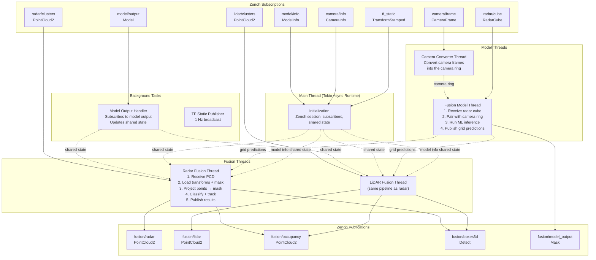
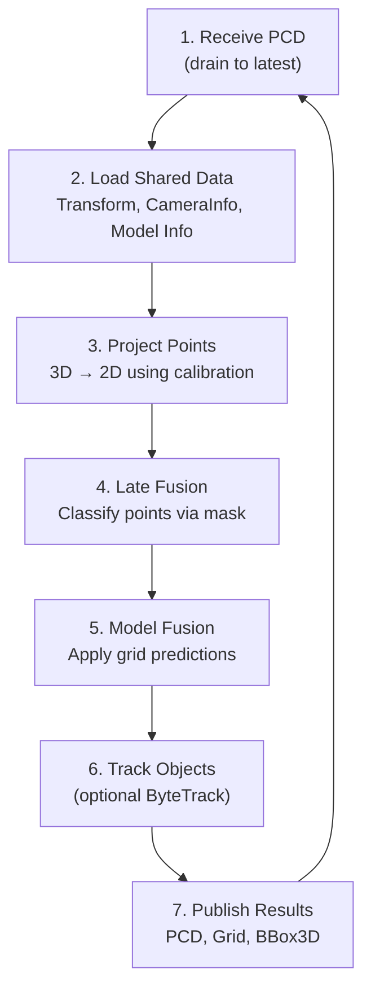
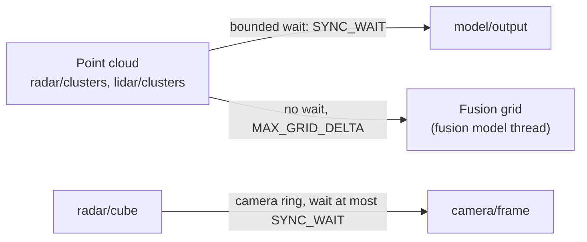
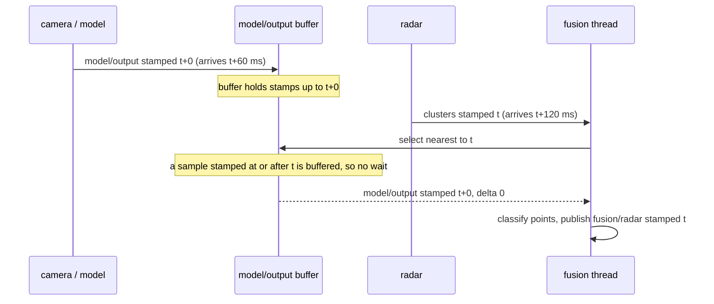

# EdgeFirst Fusion - Architecture

**Technical architecture documentation for developers**

This document describes the internal architecture of EdgeFirst Fusion, focusing on thread models, data flow patterns, and system design decisions. For user-facing documentation, see [README.md](README.md).

---

## Table of Contents

1. [System Overview](#system-overview)
2. [Thread Architecture](#thread-architecture)
3. [Data Flow](#data-flow)
4. [Timestamps and Temporal Alignment](#timestamps-and-temporal-alignment)
5. [Message Formats](#message-formats)
6. [Hardware Integration](#hardware-integration)
7. [Instrumentation and Profiling](#instrumentation-and-profiling)
8. [References](#references)

---

## System Overview

EdgeFirst Fusion is a multi-threaded, asynchronous application built on the Tokio async runtime. It implements a **subscribe-process-publish** pattern where sensor data arrives via Zenoh subscriptions, is processed through fusion and tracking pipelines, and results are published back to Zenoh topics.

### Architecture Diagram


```mermaid
graph TB
    subgraph "Zenoh Subscriptions"
        RadarSub["radar/clusters<br/>PointCloud2"]
        LidarSub["lidar/clusters<br/>PointCloud2"]
        CameraSub["camera/frame<br/>CameraFrame"]
        ModelSub["model/output<br/>Model"]
        InfoSub["camera/info<br/>CameraInfo"]
        TFSub["tf_static<br/>TransformStamped"]
        CubeSub["radar/cube<br/>RadarCube"]
        ModelInfoSub["model/info<br/>ModelInfo"]
    end

    subgraph "Main Thread (Tokio Async Runtime)"
        Init["Initialization<br/>Zenoh session, subscribers,<br/>shared state"]
    end

    subgraph "Fusion Threads"
        RadarThread["Radar Fusion Thread<br/>1. Receive PCD<br/>2. Load transforms + mask<br/>3. Project points → mask<br/>4. Classify + track<br/>5. Publish results"]
        LidarThread["LiDAR Fusion Thread<br/>(same pipeline as radar)"]
    end

    subgraph "Model Threads"
        ConvThread["Camera Converter Thread<br/>Convert camera frames<br/>into the camera ring"]
        ModelThread["Fusion Model Thread<br/>1. Receive radar cube<br/>2. Pair with camera ring<br/>3. Run ML inference<br/>4. Publish grid predictions"]
    end

    subgraph "Background Tasks"
        ModelTask["Model Output Handler<br/>Subscribes to model output<br/>Updates shared state"]
        TFTask["TF Static Publisher<br/>1 Hz broadcast"]
    end

    subgraph "Zenoh Publications"
        RadarOut["fusion/radar<br/>PointCloud2"]
        LidarOut["fusion/lidar<br/>PointCloud2"]
        GridOut["fusion/occupancy<br/>PointCloud2"]
        BBoxOut["fusion/boxes3d<br/>Detect"]
        ModelOut["fusion/model_output<br/>Mask"]
    end

    RadarSub --> RadarThread
    LidarSub --> LidarThread
    CameraSub --> ConvThread
    ConvThread -.->|"camera ring"| ModelThread
    CubeSub --> ModelThread
    ModelSub --> ModelTask
    ModelInfoSub --> Init
    InfoSub --> Init
    TFSub --> Init

    RadarThread --> RadarOut
    RadarThread --> GridOut
    RadarThread --> BBoxOut
    LidarThread --> LidarOut
    LidarThread --> GridOut
    LidarThread --> BBoxOut
    ModelThread --> ModelOut

    ModelTask -.->|"shared state"| RadarThread
    ModelTask -.->|"shared state"| LidarThread
    Init -.->|"shared state"| RadarThread
    Init -.->|"shared state"| LidarThread
    ModelThread -.->|"grid predictions"| RadarThread
    ModelThread -.->|"grid predictions"| LidarThread
    Init -.->|"model info shared state"| RadarThread
    Init -.->|"model info shared state"| LidarThread
```

### Key Architectural Properties

- **Shared State via Mutex**: Camera info, transforms, and model info are shared between threads using `tokio::sync::Mutex`. The stamp-keyed `model/output` and grid buffers, and the camera ring, use a `std::sync::Mutex` that is never held across an `.await`, with a `tokio::sync::Notify` to wake waiting readers
- **Dedicated Fusion Threads**: Radar and LiDAR processing each run in their own thread with a dedicated single-threaded Tokio runtime
- **Independent Model Thread**: ML inference runs independently, publishing predictions consumed by fusion threads. With a radar and camera model, a separate camera converter thread converts camera frames as they arrive so conversion never waits behind inference
- **Stamp pairing**: Fusion threads take the newest point cloud, then pair it with the model output, grid, or camera frame whose `header.stamp` is nearest, rather than with whichever arrived last (see [Timestamps and Temporal Alignment](#timestamps-and-temporal-alignment))
- **Configurable Pipeline**: Sensor sources, output topics, and processing stages are all configurable via CLI

---

## Thread Architecture

### Main Thread (Tokio Multi-Threaded Runtime)

**Responsibilities:**

- Initialize Zenoh session and declare all subscribers/publishers
- Set up shared state (camera info, transforms, mask)
- Spawn dedicated processing threads
- Launch background tasks (TF static publisher, model output handler)

**Execution Model:**

The main thread runs within `#[tokio::main]` and coordinates startup:

1. Parse CLI arguments
2. Initialize tracing (stdout, journald, Tracy)
3. Open Zenoh session
4. Set up shared state with `Arc<Mutex<_>>`
5. Spawn model output handler thread
6. Spawn fusion model thread
7. Spawn radar and LiDAR fusion threads
8. Wait for fusion threads to complete

---

### Fusion Threads (Radar / LiDAR)

Each fusion thread runs a continuous processing loop:


```mermaid
graph TD
    Receive["1. Receive PCD<br/>(drain to latest)"] --> Load["2. Load Shared Data<br/>Transform, CameraInfo, Model Info"]
    Load --> Project["3. Project Points<br/>3D → 2D using calibration"]
    Project --> Classify["4. Late Fusion<br/>Classify points via mask"]
    Classify --> ModelFuse["5. Model Fusion<br/>Apply grid predictions"]
    ModelFuse --> Track["6. Track Objects<br/>(optional ByteTrack)"]
    Track --> Publish["7. Publish Results<br/>PCD, Grid, BBox3D"]
    Publish --> Receive
```

**Processing Pipeline Details:**

1. **Receive**: Drain the Zenoh subscription queue and process only the newest point cloud. Includes exponential backoff timeout (2s → 1h) when no data arrives.
2. **Load**: Acquire locks on shared camera info, transforms, and model info. Skip frame if any required data is unavailable. The model output and fusion grid are not taken here; they are selected by stamp in steps 4 and 5.
3. **Project**: Using the TF transform (base_link → sensor) and camera intrinsics, project 3D points to 2D camera coordinates. The original point XYZ values are **not modified** — the projection is used only to determine which pixel each point maps to for classification. The output retains the original sensor-frame coordinates and `frame_id`.
4. **Late Fusion (Vision)**: Select the `model/output` buffered nearest the pairing target, waiting up to `SYNC_WAIT` for one stamped at or after it. For each projected point, sample its segmentation mask to assign a class label. Supports both clustered (per-cluster majority vote) and non-clustered (per-point) modes.
5. **Model Fusion**: Select the grid predictions nearest the pairing target (no wait) and classify points by spatial proximity to the predicted occupancy cells.
6. **Track**: ByteTrack tracker associates detections across frames using IoU matching and Kalman filtering. Maintains object persistence for configurable duration after disappearing.
7. **Publish**: Serialize enriched point cloud, occupancy grid, and 3D bounding boxes as ROS2 CDR messages and publish to Zenoh.

**Thread Count:** 1 per enabled sensor source (radar, LiDAR)

**Sensor orientation assumptions:**

- **Camera image is in its natural orientation.** Fusion assumes the camera publishes an upright image. The camera's `MIRROR` setting exists only to undo the sensor mount; for example, Maivin and Raivin mount the camera upside down and use `MIRROR=both`. Fusion does not read `MIRROR` and applies no flip of its own.
- **Transforms and intrinsics are calibration only.** The camera `tf_static` (base_link → camera_optical) and `camera/info` describe the natural image. The sensor transforms describe each sensor's real pose. None of them encode a mount flip or a display mirror.
- **Point clouds are right-handed and unmirrored.** LiDAR and radar publish points in their own sensor frame. Display mirroring is a WebUI view option only.

---

### Fusion Model Thread

**Responsibilities:**

- Subscribe to radar cubes (and to camera frames for a camera-only model)
- Pre-process inputs (image scaling via G2D, radar cube formatting)
- Run ML inference (TFLite)
- Publish grid predictions to shared state

**Supported Engines:**

- **TFLite (.tflite)**: TensorFlow Lite with optional NPU delegate

**Processing Pipeline:**

```
[Receive]     Camera DMA + Radar Cube
   ↓
[Pair]        Radar cube <-> camera frame by stamp (radar + camera models)
   ↓
[Preprocess]  G2D image resize + format conversion
   ↓          Radar cube normalization
[Inference]   TFLite model execution
   ↓
[Postprocess] Sigmoid activation (optional)
   ↓          Grid extraction
[Publish]     Update shared grid state + publish mask
```

**Thread Count:** 1 (when `--model` is specified), plus the camera converter thread for a model with both radar and camera inputs

---

### Camera Converter Thread

Runs only for a model with both radar and camera inputs, on its own single-threaded Tokio runtime with its own G2D context. It subscribes to the camera topic and converts each frame to model-input size into the next slot of the camera ring as soon as it arrives, because the `CameraFrame` only references a DMA buffer the camera recycles. Conversion happens in a spare image outside the ring lock, which is then swapped into the oldest slot. The fusion model thread locks the ring only to pick the nearest slot and copy it into the input tensor. The converter skips frames that arrive too late to read safely and logs `no <camera topic> for N s` when frames stop. It stops when the fusion model thread exits.

The camera re-queues each capture buffer as soon as it publishes the frame, so with `N` capture buffers at frame period `T` the driver starts overwriting a frame's buffer about `(N - 1) T` after its end-of-frame stamp. The converter learns `N` from the number of distinct DMA-BUF file descriptors the camera process cycles through, and `T` from the median stamp interval, over the last 64 frames. It skips a frame older than `(N - 1) T` less a margin of a quarter period (at least 5 ms) when it arrives, and logs the learned values once, for example `camera/frame: camera cycles 6 buffers at 30.0 FPS; frames older than 158 ms are skipped`. Until 32 frames have been seen, or after the camera restarts with a new process ID, the limit uses the buffers and the shortest interval seen so far, which can only understate it; frames are skipped until two buffers have been seen. A stream that shows a single descriptor for 32 frames does not identify its buffers by fd and gets 100 ms (4 buffers at 30 FPS). The camera service's `CAMERA_BUFFERS` setting controls `N`.

**Thread Count:** 1 (radar + camera model only)

---

### Model Output Handler

**Responsibilities:**

Subscribes to unified vision model output topic. Deserializes detection boxes, instance segmentation masks, and semantic segmentation. Updates shared state for fusion threads.

**Thread Count:** 1

---

### TF Static Publisher (Background Task)

Publishes a static transform from `base_link` to `base_link_optical` at 1 Hz for ROS2 compatibility. Each republish is stamped with the current time. Runs as a detached Tokio task on the main runtime's thread pool.

---

## Data Flow

### Shared State Communication

Threads communicate through shared state. Calibration, transforms and labels are protected by `tokio::sync::Mutex`; the stamp-keyed buffers use a `std::sync::Mutex` never held across an `.await`, plus a `tokio::sync::Notify` for waiting readers:

| State | Lock | Writer | Readers | Purpose |
|-------|------|--------|---------|---------|
| `CameraInfo` | tokio | Main thread (subscriber callback) | Fusion threads | Camera calibration matrix |
| `ModelOutput` | std (`SyncedTopic`) | Zenoh callback | Fusion threads | Stamp-keyed buffer of `model/output` (`MODEL_BUFFER_SIZE`) for late fusion |
| `Transform` | tokio | Main thread (subscriber callback) | Fusion threads | Sensor-to-base_link transforms |
| `Grid` | std (`SyncedTopic`) | Model thread | Fusion threads | Stamp-keyed buffer of ML model occupancy predictions |
| `ModelInfo` | tokio | `model_info_callback` (Zenoh cb) | Fusion threads | Model info for dynamic label resolution |
| Camera ring | std (`SharedCameraRing`) | Camera converter thread | Model thread | Converted camera frames by stamp (`CAMERA_BUFFER_SIZE`) |

### Drain-Receive Pattern

Fusion threads use a drain-receive pattern to ensure they always process the most recent data:

1. **Drain**: Call `sub.drain().last()` to discard queued messages and get the newest
2. **Timeout**: If no messages queued, block with exponential backoff timeout
3. **Backpressure**: Old messages are implicitly dropped, preventing processing lag

---

## Timestamps and Temporal Alignment

Every input is paired with the others by acquisition stamp (`header.stamp`), not by arrival order. Sensors publish with different latencies, so a radar point cloud reaches fusion after the camera frame and model output for the same instant have already arrived.

### Stamp Contract

Every fusion output carries the acquisition stamp of the input it was computed from, in `header.stamp` and as the Zenoh sample timestamp. The two are equal to within the resolution of the Zenoh timestamp (about 0.23 ns). Headerless `Mask` topics have no other place to carry time, so their Zenoh timestamp is the only time information.

| Output topic | Stamp carried |
|--------------|---------------|
| `fusion/radar` | Radar point cloud stamp |
| `fusion/lidar` | LiDAR point cloud stamp |
| `fusion/occupancy` | Source point cloud stamp (`--grid-src`) |
| `fusion/boxes3d` | Source point cloud stamp (`--bbox3d-src`) |
| `fusion/model_output` | Radar cube stamp (camera frame stamp for a camera-only model) |
| `fusion/model_output/tracked` | Same as `fusion/model_output` |
| `tf_static` | Time of each 1 Hz republish |

Published stamps are CLOCK_REALTIME. Tracker lifetimes, expiry, timeouts, and buffer ageing use CLOCK_MONOTONIC, so a wall-clock step cannot stall or prematurely expire them. The `latency` statistic compares two CLOCK_REALTIME values (receive wall time minus the input stamp), so it jumps across a clock step.

### Pairing


```mermaid
graph LR
    PCD["Point cloud<br/>radar/clusters, lidar/clusters"]
    MO["model/output"]
    Grid["Fusion grid<br/>(fusion model thread)"]
    Cube["radar/cube"]
    Cam["camera/frame"]

    PCD -->|"bounded wait: SYNC_WAIT"| MO
    PCD -->|"no wait, MAX_GRID_DELTA"| Grid
    Cube -->|"camera ring, wait at most SYNC_WAIT"| Cam
```

- **Point cloud and `model/output`**: `model/output` samples are kept in a buffer of `MODEL_BUFFER_SIZE` entries, ordered by arrival. For each point cloud the fusion thread picks the buffered sample nearest the target. If every buffered stamp is earlier than the target, it waits up to `SYNC_WAIT` for a sample at or after the target, so the nearest one is final; on timeout it uses the nearest available. The radar and LiDAR threads wait on the same buffer without holding its lock, and both wake on each arrival.
- **Point cloud and fusion grid**: the fusion model thread publishes each grid's predictions into a stamp-keyed buffer, stamped with the radar cube stamp. The fusion thread picks the grid nearest the point-cloud stamp itself (the time offsets below do not apply, since they correct for the camera's view) without waiting. The grid for an instant reaches the fusion thread after the cube latency, the camera wait and inference (about 290 ms on a Maivin), while radar targets arrive about 130 ms after their stamp, so the nearest grid is typically about 145 ms older than the point cloud. It therefore has its own gate, `MAX_GRID_DELTA` (default 0.3 s). Waiting for the matching grid would delay every fusion output by that difference.
- **Radar cube and camera frame** (models with both inputs): the camera converter thread converts each camera frame to model-input size into a ring of `CAMERA_BUFFER_SIZE` slots as it arrives, tagged with its stamp, because the `CameraFrame` only references a DMA buffer the camera recycles. A cube arrives 110-150 ms after its stamp, so its frame is several slots back. When a cube arrives (only the newest queued cube is used), the fusion model thread picks the slot nearest the cube stamp; if the ring holds nothing at or after the cube stamp it waits at most `SYNC_WAIT` for a frame that is. A camera-only model has no pairing and converts the newest frame when it runs.

The pairing target for a point cloud and `model/output` is the point-cloud stamp plus `RADAR_TIME_OFFSET` or `LIDAR_TIME_OFFSET`. The offsets absorb a constant residual between the sensor stamp and the camera's view of the scene (for example the point in a LiDAR sweep that crosses the camera field of view). Fusion does not subtract any sensor latency: the radar and LiDAR publishers already stamp with acquisition time.

The selection is bounded by `MAX_TEMPORAL_DELTA` (`MAX_GRID_DELTA` for the grid). When the nearest candidate is farther than that from the target, the input is skipped for this frame (points are left unclassified, or inference is skipped for the cube pairing). A value of `0` disables the bound and always uses the nearest candidate. Buffered entries and camera ring slots received more than 2 s ago are never paired.


```mermaid
sequenceDiagram
    participant Cam as camera / model
    participant Buf as model/output buffer
    participant Rad as radar
    participant F as fusion thread

    Cam->>Buf: model/output stamped t+0 (arrives t+60 ms)
    Note over Buf: buffer holds stamps up to t+0
    Rad->>F: clusters stamped t (arrives t+120 ms)
    F->>Buf: select nearest to t
    Note over Buf: a sample stamped at or after t is buffered, so no wait
    Buf-->>F: model/output stamped t+0, delta 0
    F->>F: classify points, publish fusion/radar stamped t
```

If the model output for stamp *t* has not arrived when the point cloud does (all buffered stamps are earlier than *t*), the thread waits up to `SYNC_WAIT` for the next model output to be pushed, then takes the nearest one.

### Clock Steps and Gaps

Each stamp-keyed buffer and the camera ring watch the stamp sequence of their topic. A backward step larger than 1 s (a clock step) or a forward jump larger than 1 s (a step or a sensor dropout) clears the buffered entries, since old entries are in a different time domain. For the `model/output` and grid buffers a backward step logs a warning naming the topic and a forward jump is logged at DEBUG; the camera ring clears silently. The fusion-grid tracker also resets when the grid stamp steps back, so its tracks do not freeze.

A service that stops publishing is detected by receive time: buffered entries and camera ring slots received more than 2 s ago are never paired, and `MAX_MODEL_AGE` warns when the newest model output was received longer ago than the limit. The fusion model thread logs `no <radar cube topic> for N s` and the camera converter thread `no <camera topic> for N s` when their input stops, first after 2 s and then at doubling intervals up to 1 h, restarting when data arrives.

### Grid Tracking

The grid tracker (`--track`) belongs to the fusion model thread and runs once per model grid, in grid-index coordinates. The fusion threads read the resulting predictions from the grid buffer and never re-ingest a grid. Point-cloud centroid tracking uses a separate tracker per fusion thread. `fusion/model_output/tracked` is published only by the fusion model thread.

### Statistics

Each fusion thread logs a line every `STATS_INTERVAL` seconds (`0` disables), prefixed with the pipeline: `fusion/radar` or `fusion/lidar` for point-cloud pairing, and `fusion/model cube↔camera` for the radar-cube and camera pairing:

```text
[fusion/radar] paired=118 too_far=0 missing=2 grid_too_far=0 grid_missing=0 delta p50=-4.1ms max=12.0ms grid_delta p50=-144.1ms max=181.0ms wait p50=0.0ms max=50.0ms latency p50=121.3ms max=140.2ms
[fusion/model cube↔camera] paired=100 too_far=0 missing=0 stale=0 delta p50=-3.0ms max=16.0ms wait p50=0.0ms max=0.0ms latency p50=125.0ms max=150.1ms
```

| Field | Meaning |
|-------|---------|
| `paired` | Selections within `MAX_TEMPORAL_DELTA` in the window: `model/output` selections on a point-cloud line, camera frames on the cube and camera line. |
| `too_far` | Selections whose nearest candidate was farther than `MAX_TEMPORAL_DELTA`, so the input was skipped. Persistent counts mean the inputs are in different clock domains or a service is stalled. |
| `missing` | Nothing buffered to pair with (nothing yet, or every entry aged out). Not counted when `VISION_MODEL_TOPIC` is empty. |
| `grid_too_far`, `grid_missing` | The same for fusion-grid selections against `MAX_GRID_DELTA`. Point-cloud lines only. |
| `stale` | Camera frames skipped because they arrived too long after capture, so their camera buffer may already be overwritten. Cube and camera line only. |
| `delta` | Signed stamp difference (candidate minus target) of paired selections: median and largest magnitude. |
| `grid_delta` | The same for paired grids (grid stamp minus point-cloud stamp). |
| `wait` | Time spent waiting for a sample at or after the target: median and maximum. |
| `latency` | Receive time minus the point-cloud stamp (cube stamp on the cube and camera line): median and maximum. |

Warnings name the topics and the difference: `[<pipeline>] model/output stamp is … s from the point cloud`, separately `[<pipeline>] fusion grid stamp is … s from the point cloud`, and for the cube pairing `<radar cube topic> and <camera topic> stamps differ by …`. Each is logged the first time its limit is exceeded, and again at most once per stats interval while skips continue; with `STATS_INTERVAL=0` each is logged once per run. The stale-conversion warning follows the same rule.

Mixed producer versions can put topics in different clock domains (for example a radar cube stamped with the sensor power-on clock). Every pairing then exceeds `MAX_TEMPORAL_DELTA`; the single warning identifies the topics, and `too_far` counts the skips. Setting `MAX_TEMPORAL_DELTA=0` restores nearest-only pairing.

---

## Message Formats

All messages use **ROS2 CDR (Common Data Representation)** serialization.

### Input Messages

| Topic | Type | Description |
|-------|------|-------------|
| `radar/clusters` | `sensor_msgs/PointCloud2` | Radar point cloud with optional cluster_id |
| `lidar/clusters` | `sensor_msgs/PointCloud2` | LiDAR point cloud with optional cluster_id |
| `camera/frame` | `edgefirst_msgs/CameraFrame` | Camera frame tensor (dma-buf planes) |
| `radar/cube` | `edgefirst_msgs/RadarCube` | Radar cube for ML model input |
| `model/output` | `edgefirst_msgs/Model` | Unified vision model output (boxes, masks, segmentation) |
| `model/info` | `edgefirst_msgs/ModelInfo` | Model info for dynamic label resolution |
| `camera/info` | `sensor_msgs/CameraInfo` | Camera calibration parameters |
| `tf_static` | `geometry_msgs/TransformStamped` | Static coordinate transforms |

### Output Messages

| Topic | Type | Description |
|-------|------|-------------|
| `fusion/radar` | `sensor_msgs/PointCloud2` | Radar PCD with vision_class + instance_id fields |
| `fusion/lidar` | `sensor_msgs/PointCloud2` | LiDAR PCD with vision_class + instance_id fields |
| `fusion/occupancy` | `sensor_msgs/PointCloud2` | Occupancy grid as point cloud |
| `fusion/boxes3d` | `edgefirst_msgs/Detect` | 3D bounding boxes from clustered points |
| `fusion/model_output` | `edgefirst_msgs/Mask` | Raw ML model grid output |
| `fusion/model_output/tracked` | `edgefirst_msgs/Mask` | Tracked ML model grid (with `--track`) |

### Enriched Point Cloud Fields

The fusion output adds classification fields to input point clouds:

| Field | Type | Description |
|-------|------|-------------|
| `x`, `y`, `z` | FLOAT32 | 3D coordinates (unchanged from source, in the original sensor frame) |
| `vision_class` | UINT16 | Class from vision model projection |
| `instance_id` | UINT16 | Instance identifier (0 = no instance) |
| `track_id` | UINT32 | Track hash (only present when tracking detected, 0 = untracked) |

> **Note:** When a fusion model is configured (early/mid fusion), the output uses a different layout with fusion_class(u8), vision_class(u8), and instance_id(u16).

---

## Hardware Integration

### NXP G2D - Image Format Conversion

Used by the fusion model thread to resize and convert camera frames for ML model input:

- **Format Conversion**: YUYV → RGB/NV12 for model input
- **Scaling**: Camera resolution → model input resolution
- **Rotation**: Configurable rotation support
- **Access**: Via `g2d-sys` crate FFI bindings to `/dev/galcore`

See `src/image.rs` for G2D integration.

### TFLite Runtime

Loaded dynamically via `tflitec-sys` FFI bindings:

- Searches for `libtensorflow-lite.so.2.X.Y` (versions 1-49, patches 0-9)
- Falls back to `libtensorflowlite_c.so`
- Supports external delegates (NPU acceleration) via `tflite_plugin_create_delegate`

See `tflitec-sys/` for FFI bindings and `src/tflite_model.rs` for model loading.

### CameraFrame Handling

Camera frames are received as `edgefirst_msgs/CameraFrame` tensors with DMA-BUF planes:

1. Decode `CameraFrame` from CDR and read plane 0 (`handle`, `offset`, `stride`)
2. Import the file descriptor with `pidfd_getfd` using the tensor `pid`
3. Memory-map the buffer with `mmap(MAP_SHARED)`
4. Pass to G2D for hardware-accelerated format conversion
5. Use converted buffer as ML model input

See `src/image.rs` for CameraFrame import and DMA-BUF lifecycle management.

---

## Occupancy Grid Generation

Fusion generates occupancy grids from radar or LiDAR point clouds. Two modes are supported depending on whether the input PCD contains a `cluster_id` field:

**Clustered Mode** (PCD has `cluster_id`): Each cluster's centroid and bounding box are used to place occupied cells in the grid. Points are grouped by cluster ID, and the grid is populated directly from cluster geometry.

**Non-Clustered Mode** (PCD lacks `cluster_id`): Points are binned into a polar grid defined by `--range-bin-limit`, `--range-bin-width`, `--angle-bin-limit`, and `--angle-bin-width`. A temporal persistence filter (`--threshold`, `--bin-delay`) requires bins to be occupied for multiple frames before they are emitted, reducing noise.

The occupancy grid is published as a `sensor_msgs/PointCloud2` message on the `--grid-topic`.

---

## Instrumentation and Profiling

### Tracing Architecture

The application uses `tracing-subscriber` with multiple layers:

1. **stdout_log** - Console output with pretty formatting (filtered by `RUST_LOG`)
2. **journald** - systemd journal integration (filtered by `RUST_LOG`)
3. **tracy** - Tracy profiler integration (optional, `--tracy` flag)

### Tracy Integration

Key instrumented functions use `#[instrument]` attributes:

- `load_data` - Shared state acquisition timing
- `fusion` - Core fusion pipeline timing
- `publish` - Zenoh publishing timing
- `publish_bbox3d`, `publish_output`, `publish_grid` - Individual output timing

Frame marks track the fusion loop iteration rate.

### Instrumentation Points

**Fusion Thread:**
- PCD receive and deserialization
- Transform lookup and projection
- Late fusion classification
- Model prediction application
- Tracking update
- Result serialization and publishing

**Model Thread:**
- CameraFrame reception
- Image preprocessing (G2D)
- Model inference timing
- Grid extraction and publishing

---

## References

**Rust Crates:**

- [tokio](https://tokio.rs/) - Async runtime
- [zenoh](https://zenoh.io/) - Pub/sub middleware
- [nalgebra](https://nalgebra.org/) - Linear algebra for transforms
- [ndarray](https://docs.rs/ndarray/) - N-dimensional arrays for model I/O

**Hardware Documentation:**

- [NXP i.MX8M Plus Reference Manual](https://www.nxp.com/docs/en/reference-manual/IMX8MPRM.pdf)

**ROS2 Standards:**

- [ROS2 CDR Serialization](https://design.ros2.org/articles/generated_interfaces_cpp.html)
- [sensor_msgs/PointCloud2](https://docs.ros2.org/latest/api/sensor_msgs/msg/PointCloud2.html)
- [sensor_msgs/CameraInfo](https://docs.ros2.org/latest/api/sensor_msgs/msg/CameraInfo.html)

**Algorithms:**

- [ByteTrack: Multi-Object Tracking by Associating Every Detection Box](https://arxiv.org/abs/2110.06864)
- [Kalman Filter](https://en.wikipedia.org/wiki/Kalman_filter) - State estimation for object tracking
