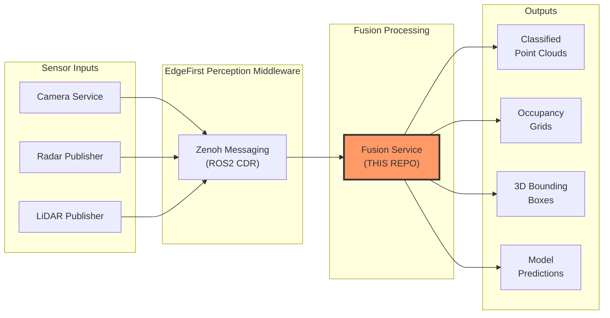

# EdgeFirst Fusion

**Multi-modal sensor fusion with ML inference, object tracking, and occupancy grid generation for edge AI platforms**

[](LICENSE)
[](https://www.rust-lang.org/)
[]()
[](https://github.com/EdgeFirstAI/fusion/actions/workflows/build.yml)
[](https://github.com/EdgeFirstAI/fusion/actions/workflows/test.yml)

---

## Overview

EdgeFirst Fusion is a real-time sensor fusion service designed for edge AI perception systems. It combines data from cameras, radar, and LiDAR sensors to perform late fusion classification, ML-based occupancy grid prediction, and multi-object tracking. The service publishes ROS2-compatible messages over Zenoh for seamless integration with robotics and vision ecosystems.

**Key Features:**

- **Late Fusion** - Projects radar/LiDAR points onto camera segmentation masks for per-point classification
- **ML Inference** - Runs TFLite or DeepView RT models for radar-camera fusion occupancy grids
- **Object Tracking** - ByteTrack-based multi-object tracker with Kalman filtering
- **Occupancy Grids** - Generates polar or cartesian occupancy grids from sensor data
- **3D Bounding Boxes** - Produces 3D bounding boxes from clustered point clouds
- **Zero-Copy DMA** - Direct memory access for low-latency camera frame processing
- **Hardware Acceleration** - NXP G2D for image format conversion, NPU for ML inference
- **Production Ready** - Tracy profiling, journald logging, configurable Zenoh transport

---

## EdgeFirst Perception Ecosystem

EdgeFirst Fusion is the **sensor fusion layer** of the EdgeFirst Perception Middleware — a modular software stack for edge AI vision systems.

### Architecture Context



**What Fusion Does:**

- **Subscribes** to camera DMA buffers, radar/LiDAR point clouds, and segmentation masks
- **Projects** 3D sensor points onto 2D camera masks using calibration transforms
- **Classifies** each point based on the vision model's segmentation output
- **Runs** ML models on radar cubes and camera frames for occupancy prediction
- **Tracks** objects across frames with Kalman-filtered ByteTrack
- **Publishes** enriched point clouds, occupancy grids, and 3D bounding boxes

**Learn More:** [EdgeFirst Perception Documentation](https://doc.edgefirst.ai/latest/perception)

---

## Quick Start

### Prerequisites

**Hardware:**

- NXP i.MX8M Plus based platform (Maivin, Raivin) or compatible ARM64 device
- Sensors: Camera + Radar and/or LiDAR
- Minimum: 2GB RAM, quad-core ARM Cortex-A53

**Software:**

- Linux kernel 5.10+ with V4L2 support
- Rust 1.82 or later (for building from source)
- EdgeFirst Camera, Radar, and/or LiDAR publisher services running
- OR: Pre-built binaries from [GitHub Releases](https://github.com/EdgeFirstAI/fusion/releases)

### Installation

**Option 1: Pre-built Binary (Recommended)**

```bash
# Download latest release for ARM64
wget https://github.com/EdgeFirstAI/fusion/releases/latest/download/edgefirst-fusion-linux-aarch64

# Make executable
chmod +x edgefirst-fusion-linux-aarch64

# Run with a fusion model
./edgefirst-fusion-linux-aarch64 --model model.rtm --track
```

**Option 2: Build from Source**

```bash
# Clone repository
git clone https://github.com/EdgeFirstAI/fusion.git
cd fusion

# Build release binary (TFLite-only, default)
cargo build --release

# Build with DeepView RT support (requires libdeepview-rt installed)
cargo build --release --features deepviewrt

# Run
./target/release/edgefirst-fusion --model model.tflite --track
```

### Basic Usage

**Radar-Camera Fusion with Tracking:**

```bash
edgefirst-fusion \
  --model model.rtm \
  --engine npu \
  --track \
  --radar-pcd-topic rt/radar/clusters \
  --grid-src radar
```

**LiDAR-Camera Fusion:**

```bash
edgefirst-fusion \
  --lidar-pcd-topic rt/lidar/clusters \
  --bbox3d-src lidar \
  --grid-src lidar
```

**Custom Topics:**

```bash
edgefirst-fusion \
  --radar-pcd-topic rt/radar/clusters \
  --lidar-pcd-topic rt/lidar/clusters \
  --camera-topic rt/camera/dma \
  --vision-model-topic rt/model/output \
  --lidar-pcd-topic rt/lidar/clusters \
  --radar-pcd-topic rt/radar/clusters \
  --model model.rtm
```

---

## Configuration

### Command-Line Options

```bash
edgefirst-fusion --help
```

**Sensor Input Topics:**

- `--radar-pcd-topic <TOPIC>` - Radar point cloud input (default: empty/disabled)
- `--lidar-pcd-topic <TOPIC>` - LiDAR point cloud input (default: empty/disabled)
- `--camera-topic <TOPIC>` - Camera DMA buffer input (default: `rt/camera/dma`)
- `--radarcube-topic <TOPIC>` - Radar cube input (default: `rt/radar/cube`)
- `--vision-model-topic <TOPIC>` - Unified vision model output (default: `rt/model/output`)
- `--model-info-topic <TOPIC>` - Model info for label resolution (default: `rt/model/info`)
- `--info-topic <TOPIC>` - Camera info input (default: `rt/camera/info`)

**Output Topics:**

- `--radar-output-topic <TOPIC>` - Enriched radar point cloud (default: `rt/fusion/radar`)
- `--lidar-output-topic <TOPIC>` - Enriched LiDAR point cloud (default: `rt/fusion/lidar`)
- `--grid-topic <TOPIC>` - Occupancy grid output (default: `rt/fusion/occupancy`)
- `--bbox3d-topic <TOPIC>` - 3D bounding boxes output (default: `rt/fusion/boxes3d`)
- `--model-output-topic <TOPIC>` - Model predictions output (default: `rt/fusion/model_output`)

**ML Model Configuration:**

- `--model <PATH>` - Path to fusion model (.tflite by default, or .rtm with the `deepviewrt` feature)
- `--model-decoder <PATH>` - Path to model decoder (optional)
- `--engine <ENGINE>` - Inference engine: `npu`, `cpu` (default: `npu`)
- `--model-threshold <FLOAT>` - Detection threshold (default: `0.5`)
- `--model-grid-size <W> <H>` - Grid cell real-world size in meters (default: `1 1`)
- `--model-polar` - Use polar coordinate model grid
- `--logits` - Apply sigmoid to model output (default: `true`)

**Vision & Instance Detection:**

- `--max-model-age <SECS>` - Maximum age in seconds for model output data before warning (default: `0.5`, 0 = disabled)

**Tracking Configuration:**

- `--track` - Enable ByteTrack object tracking
- `--track-extra-lifespan <SECS>` - Track persistence after disappearing (default: `0.5`)
- `--track-iou <FLOAT>` - IoU threshold for track association (default: `0.1`)
- `--track-update <FLOAT>` - Kalman filter update factor, 0.0-1.0 (default: `0.4`)

**Occupancy Grid Configuration:**

- `--grid-src <radar|lidar|disabled>` - Occupancy grid source (default: `radar`)
- `--bbox3d-src <radar|lidar|disabled>` - 3D bounding box source (default: `lidar`)
- `--range-bin-limit <MIN> <MAX>` - Range bin limits in meters (default: `0 16`)
- `--range-bin-width <FLOAT>` - Range bin width in meters (default: `1.0`)
- `--angle-bin-limit <MIN> <MAX>` - Angle bin limits in degrees (default: `-55 55`)
- `--angle-bin-width <FLOAT>` - Angle bin width in degrees (default: `6.875`)

**Zenoh Configuration:**

- `--mode <peer|client|router>` - Zenoh participant mode (default: `peer`)
- `--connect <ENDPOINT>` - Connect to Zenoh router
- `--listen <ENDPOINT>` - Listen for Zenoh connections
- `--no-multicast-scouting` - Disable multicast discovery

**Debugging:**

- `--tracy` - Enable Tracy profiler broadcast

### Environment Variables

All command-line flags can be set via environment variables (uppercase, underscore-separated):

```bash
export MODEL=/path/to/model.rtm
export ENGINE=npu
export TRACK=true

edgefirst-fusion  # Uses environment configuration
```

---

## Platform Support

### Tested Platforms

| Platform | Architecture | Status | Notes |
|----------|--------------|--------|-------|
| Maivin + Raivin | ARM64 (i.MX8M Plus) | Fully Supported | Primary target, NPU + G2D acceleration |
| NXP i.MX8M Plus EVK | ARM64 | Supported | Hardware acceleration available |
| Generic ARM64 Linux | ARM64 | Partial | CPU-only inference, no G2D |
| x86_64 Linux | x86_64 | Development Only | CPU inference, software image conversion |

### Sensor Compatibility

**Radar:** Any sensor publishing `sensor_msgs/PointCloud2` to Zenoh (e.g., SmartMicro DRVEGRD series)

**LiDAR:** Any sensor publishing `sensor_msgs/PointCloud2` to Zenoh (e.g., Ouster OS1)

**Camera:** EdgeFirst Camera service providing DMA buffers and segmentation masks

---

## Development

### Building from Source

```bash
# Clone repository
git clone https://github.com/EdgeFirstAI/fusion.git
cd fusion

# Build with all features
cargo build --release

# Run tests
cargo test

# Generate documentation
cargo doc --no-deps --open
```

### Project Structure

```
fusion/
├── src/
│   ├── main.rs          # Main loop, Zenoh pub/sub, thread coordination
│   ├── args.rs           # CLI argument parsing (clap derive)
│   ├── image.rs          # DMA buffer handling, G2D image conversion
│   ├── fusion_model.rs   # ML model thread (TFLite/DeepView RT inference)
│   ├── tflite_model.rs   # TFLite model loading and inference
│   ├── rtm_model.rs      # DeepView RT model loading and inference
│   ├── mask.rs            # Segmentation mask processing, flood fill
│   ├── pcd.rs             # Point cloud parsing and serialization
│   ├── transform.rs       # 3D-to-2D projection, coordinate transforms
│   ├── simd.rs           # NEON SIMD kernels (aarch64) with scalar fallback
│   ├── tracker.rs         # ByteTrack multi-object tracker
│   └── kalman.rs          # Kalman filter for state estimation
├── tflitec-sys/           # TensorFlow Lite C API FFI bindings
├── Cargo.toml             # Project dependencies
└── README.md              # This file
```

**See also:**

- [ARCHITECTURE.md](ARCHITECTURE.md) - Detailed architecture and design decisions
- [CONTRIBUTING.md](CONTRIBUTING.md) - Contribution guidelines and development workflow
- [SECURITY.md](SECURITY.md) - Security policy and vulnerability reporting

---

## Troubleshooting

### Common Issues

**Problem: "No Camera Info" or "No Mask" warnings**

```bash
# Ensure camera and vision model services are running
# Check that the camera publishes CameraInfo
zenoh-cli query "rt/camera/info"

# Check that the vision model publishes model output
zenoh-cli query "rt/model/output"
```

**Problem: "Did not find transform from base_link" warning**

```bash
# Ensure tf_static transforms are published for your sensor frame IDs
# Fusion waits 2 seconds at startup for transforms
zenoh-cli query "rt/tf_static"
```

**Problem: Model inference not running**

```bash
# Check that the model file exists and is readable
ls -la /path/to/model.rtm

# Try CPU engine if NPU is not available
edgefirst-fusion --model model.rtm --engine cpu

# Check for TFLite library
ldconfig -p | grep tensorflow
```

**Problem: Low processing rate**

```bash
# Enable Tracy profiling to identify bottlenecks
edgefirst-fusion --model model.rtm --tracy

# Check CPU usage
htop

# Reduce tracking overhead
edgefirst-fusion --model model.rtm  # Without --track
```

### Logging

```bash
# Set log level
RUST_LOG=debug edgefirst-fusion

# Filter specific module
RUST_LOG=edgefirst_fusion::fusion_model=trace edgefirst-fusion

# View systemd journal logs
journalctl -u edgefirst-fusion -f
```

---

## License

This project is licensed under the Apache License 2.0 - see the [LICENSE](LICENSE) file for details.

**Third-Party Components:** See [NOTICE](NOTICE) for required attributions.

---

## Contributing

We welcome contributions! Please see [CONTRIBUTING.md](CONTRIBUTING.md) for:

- Code style guidelines
- Development workflow
- Pull request process
- Testing requirements

**Found a bug?** [Open an issue](https://github.com/EdgeFirstAI/fusion/issues)

**Have a feature request?** [Start a discussion](https://github.com/orgs/EdgeFirstAI/discussions)

---

## Support

**Community Resources:**

- Documentation: https://doc.edgefirst.ai/latest/perception
- Discussions: https://github.com/orgs/EdgeFirstAI/discussions
- Issues: https://github.com/EdgeFirstAI/fusion/issues

**Commercial Support:**

- **EdgeFirst Studio**: Integrated deployment, monitoring, and management
- **Professional Services**: Training, custom development, enterprise support
- **Contact**: support@au-zone.com
